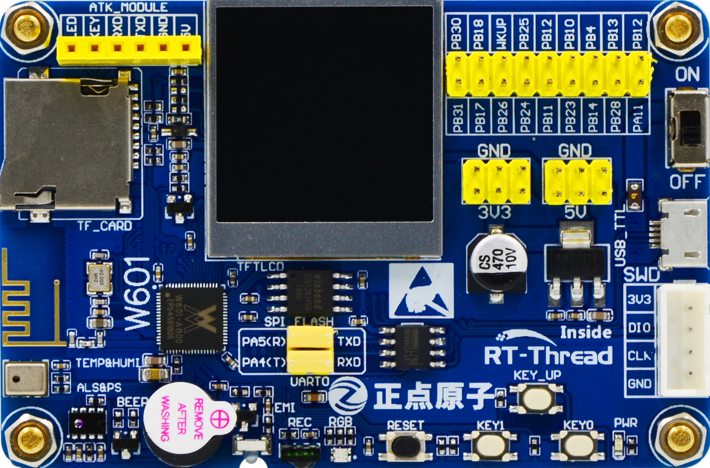

# RT-Thread W60X SDK 说明

## 内容简介

RT-Thread W60X SDK 由开发平台 W601 IoT Board 的详细介绍和丰富的软件资源组成。

随着物联网的兴起，新的开发需求不断涌现，越来越多的设备需要添加联网功能。此时使用传统的开发方式已经不足以应对日益丰富的需求，为了提高开发效率，需要使用更多的通用组件。因此在 W60X SDK 中，不仅有对开发板资源使用方式的内容，还会介绍 RT-Thread 中的通用组件以及丰富的面向物联网应用的软件包。有了这些软件包助力，会给开发者在开发过程中带来极大的便利。

## W601 IoT Board 开发板资源简介

### 硬件资源说明

W601 IoT Board 开发板如下图所示：

开发板核心芯片资源如下：

支持多接口、多协议的无线局域网 IEEE802.11n（1T1R）。集成 Cortex-M3 内核，主频 80Mhz。内置 1MB Flash 和 288KByte SRAM。集成射频收发前端 RF Transceiver，CMOS PA 功率放大器，基带处理器/媒体访问控制。支持 SDIO、SPI、UART、GPIO、I²C、PWM、I²S、7816 等接口, 支持多种加解密协议，如 PRNG/SHA1/MD5/RC4/DES/3DES/AES/CRC/RSA 等。

### 软件资源说明

本节我们将介绍 W60X SDK 的软件资源，W60X SDK 将提供丰富的例程供大家使用。每个例程都有相应的注释，方便大家理解代码。每个例程都提供 MDK 和 IAR 工程，并且支持 GCC 开发环境，开发者拿到工程后经过简单的编译和下载即可看到实验现象。

例程列表如下所示：

| 编号 | 类别   | 文件夹           | 说明                                           |
| ---- | ------ | ---------------- | ---------------------------------------------- |
| 01   | 基础   | led_blink        | LED 不间断闪烁                                 |
| 02   | 基础   | key              | 板载按键                                       |
| 03   | 基础   | rgb_led          | RGB LED 变色                                   |
| 04   | 基础   | beep             | 使用按键控制蜂鸣器                             |
| 05   | 基础   | ir               | 模拟红外线遥控器                               |
| 06   | 驱动   | lcd              | LCD 显示文字和图片                             |
| 07   | 驱动   | temp_humi        | 驱动温湿度传感器                               |
| 08   | 驱动   | als_ps           | 驱动光强/接近传感器                            |
| 09   | 组件   | fs_tf_card       | 基于 TF 卡的文件系统例程                       |
| 10   | 组件   | fal              | 使用 Flash 抽象层组件（FAL）管理 Flash 及 分区 |
| 11   | 组件   | kv               | 使用 EasyFlash 完成 KV 参数存储                |
| 12   | 组件   | fs_flash         | 基于 SPI Flash 的文件系统例程                  |
| 13   | 组件   | ulog             | 日志系统例程                                   |
| 14   | 组件   | adbd             | ADB 远程调试工具例程                           |
| 15   | 组件   | micropython      | 使用 MicroPython 控制硬件                      |
| 16   | 物联网 | wifi_manager     | 使用 WiFi Manager 管理、操作 WiFi 网络         |
| 17   | 物联网 | web_config_wifi  | 使用 web 快速接入 WiFi 网络                    |
| 18   | 物联网 | airkiss          | 使用 AirKiss 快速接入 WiFi 网络                |
| 19   | 物联网 | atk_module       | ATK模块例程                                    |
| 20   | 物联网 | at_server        | AT 指令（服务器端）例程                        |
| 21   | 物联网 | mqtt             | 使用 Paho-MQTT 软件包实现 MQTT 协议通信        |
| 22   | 物联网 | http_client      | 使用 Web Client 软件包实现 HTTP Client         |
| 23   | 物联网 | web_server       | 使用 Web 服务器组件：WebNet                    |
| 24   | 物联网 | websocket        | 使用 websocket 软件包通信                      |
| 25   | 物联网 | cjson            | 解析 JSON 数据格式例程                         |
| 26   | 物联网 | tls              | 使用 mbedtls 软件包完成 TLS 通信               |
| 27   | 物联网 | hw_crypto        | 硬件加解密功能例程                             |
| 28   | 物联网 | ota_ymodem       | 通过串口 Ymodem 协议完成 OTA 固件升级          |
| 29   | 物联网 | ota_http         | 通过 HTTP 协议完成 OTA 固件升级                |
| 30   | 物联网 | netutils         | 网络小工具集使用例程                           |
| 31   | 物联网 | cloud_rtt        | 接入 RT-Thread 物联网设备管理云平台            |
| 32   | 物联网 | cloud_onenet     | 接入中国移动 OneNET 云平台                     |
| 33   | 物联网 | cloud_ali_iotkit | 接入阿里云物联网平台                           |
| 34   | 物联网 | cloud_ms_azure   | 接入微软 Azure 物联网平台                      |
| 35   | 物联网 | cloud_tencent    | 接入腾讯云物联网平台                           |
| 36   | 综合   | demo             | 综合性示例演示                                 |

## WM_Librarie 介绍

WM_Librarie 是北京联盛德微电子有限责任公司提供的开发软件包，该软件包提供了底层硬件驱动、WiFi 协议栈、固件下载、一键配网等众多基础功能。下面将分别介绍这些功能的作用。

### WM_Librarie 功能介绍

### 一键配网功能

一键配网功能可以通过 APP 将 WiFi 名字和密码发送到开发板上，使开发板接入 WiFi 网络。支持市面上大多数的手机和路由器配网，成功概率高，配网速度快。

### 芯片外设驱动库

提供W60X芯片各外围模块的驱动支持，包括 UART、SPI、TIMER、PWM、WDG等。具有运行效率高，占用资源小的特点。

### WiFi功能库

提供了完整的 WiFi 协议栈功能，包括对 STA、SOFTAP、AP/STA 的支持。较全的WiFi功能使普通用户更容易操作WiFi，也能使高级用户更加灵活的操作WiFi。

### 固件打包功能

提供了适用于多种环境下的固件打包功能。固件生成器使用跨平台语言编译，能够在多个平台上运行。并且能够生成多个不同类型的固件，以适用于不同的升级场景。

## 文档说明

### SDK 文档介绍

SDK 相关文档在 docs 文件夹下，文档列表如下所示：

| 文档名称                                            | 说明                                     |
| --------------------------------------------------- | ---------------------------------------- |
| board 文件夹                                        | 开发板相关说明文档，如原理图、数据手册等 |
| AN0001-RT-Thread-串口设备应用笔记.pdf               | 串口驱动笔记                             |
| AN0002-RT-Thread-通用 GPIO 设备应用笔记.pdf         | 通用 GPIO 设备应用笔记                   |
| AN0003-RT-Thread-I2C 设备应用笔记.pdf               | I2C 设备应用笔记                         |
| AN0004-RT-Thread-SPI 设备应用笔记.pdf               | SPI 设备应用笔记                         |
| AN0006-RT-Thread-使用 QEMU 进行仿真调试.pdf         | 使用 QEMU 调试 RT-Thread                 |
| AN0009-RT-Thread_使用 SystemView 分析工具.pdf       | 使用 SystemView 调试                     |
| AN0010-RT-Thread-网络协议栈驱动移植笔记.pdf         | lwip 驱动移植                            |
| AN0011-RT-Thread-网络开发应用笔记.pdf               | 网络开发应用笔记                         |
| AN0012-RT-Thread-文件系统应用笔记.pdf               | RT-Thread 文件系统应用笔记               |
| AN0014-RT-Thread-AT 组件应用笔记-客户端篇.pdf       | RT-Thread AT 组件应用笔记 - 客户端篇     |
| AN0017-RT-Thread-创建标准的工程.pdf                 | 创建 RT-Thread 标准工程                  |
| AN0018-RT-Thread-网络工具集应用笔记.pdf             | RT-Thread 网络工具集 (NETUTILS)应用笔记  |
| AN0020-RT-Thread-使用 Eclipse + QEMU 调试.pdf       | 使用Eclipse + QEMU 调试 RT-Thread        |
| AN0021-RT-Thread-使用 VS Code + QEMU 调试.pdf       | 使用VS Code + QEMU 调试 RT-Thread        |
| AN0022-RT-Thread-ulog 日志组件应用笔记 - 基础篇.pdf | RT-Thread ulog 日志组件应用笔记- 基础篇  |
| AN0023-RT-Thread-使用 QEMU 运行动态模块.pdf         | 使用QEMU 运行 RT-Thread动态模块          |
| AN0024-RT-Thread-ulog 日志组件应用笔记 - 进阶篇.pdf | RT-Thread ulog 日志组件应用笔记- 进阶篇  |
| AN0025-RT-Thread-电源管理组件应用笔记.pdf           | 电源管理应用笔记                         |
| RT-Thread 编程指南.pdf                              | RT-Thread 编程指南                       |
| UM1001-RT-Thread-WebClient 用户手册.pdf             | WEBCLIENT 用户手册                       |
| UM1002-RT-Thread-ali-iotkit 用户手册.pdf            | RT-Thread ALI-IOTKIT 用户手册            |
| UM1003-RT-Thread-OneNET 用户手册.pdf                | RT-Thread ONENET 用户手册                |
| UM1004-RT-Thread-OTA 用户手册.pdf                   | RT-Thread OTA 用户手册                   |
| UM1005-RT-Thread-Paho-MQTT 用户手册.pdf             | PAHO-MQTT 用户手册                       |
| UM1006-RT-Thread-MbedTLS 用户手册.pdf               | RT-Thread MBEDTLS 用户手册               |
| UM1007-RT-Thread-Azure-IoT-SDK 用户手册.pdf         | AZURE-IOT-SDK 用户手册                   |
| UM1008-RT-Thread-设备维护云平台用户手册.pdf         | RT-Thread 云平台用户手册                 |
| UM1009-RT-Thread-电源管理组件用户手册.pdf           | POWER MANAGEMENT 用户手册                |
| UM1010-RT-Thread-Web 服务器(WebNet)用户手册.pdf     | RT-Thread WEBNET 用户手册                |
| UM3101-RT-Thread-W60X-SDK 开发手册.pdf              | RT-Thread W60X SDK 开发手册              |
| UM3102-RT-Thread-W60X-SDK 介绍.pdf                  | RT-Thread W60X SDK 说明                  |
| UM3103-RT-Thread-W60X-SDK 快速上手.pdf              | RT-Thread W60X SDK 快速入门              |
| UM3104-RT-Thread-W60X-SDK 发布说明.pdf              | RT-Thread W60X SDK 开发手册              |

### WM_Librarie 文档介绍

WM_Librarie 库中也有很多文档供大家参考学习，下面仅介绍与当前 SDK 相关的一些文档。文档路径为：RT-Thread_W60X_SDK/libraries/WM_Libraries/Doc。

| 文档名称                                               | 说明                         |
| ------------------------------------------------------ | ---------------------------- |
| OneShot Lib&Demo 文件夹                                | 一键配网源码及APP            |
| W60X_QFLASH_Driver_for_SWD 文件夹                      | Keil使用JTAG调试的QFLASH驱动 |
| WM_W600_OneShotConfig2.0(Android) SDK用户手册_V1.0.pdf | 一键配网Android SDK用户手册  |
| WM_W600_OneShotConfig2.0(IOS) SDK用户手册_V1.0.pdf     | 一键配网IOS SDK用户手册      |
| WM_W600_ROM功能简述_V1.1.pdf                           | ROM功能使用手册              |
| WM_W600_SECBOOT功能简述_V1.0.pdf                       | SECBOOT功能说明手册          |
| WM_W600_SWD调试配置指南_V1.2.pdf                       | SWD调试配置手册              |
| WM_W600_参数区使用说明_V1.1.pdf                        | 参数区使用说明手册           |
| WM_W600_固件升级指导_V1.1.pdf                          | 固件升级指导手册             |
| WM_W600_固件生成说明_V1.1.pdf                          | 固件生成说明手册             |
| WM_W601_寄存器手册_v1.2.pdf                            | 寄存器手册                   |

## 预备知识

使用 W60X SDK 需要的预备知识如下所示：

- RT-Thread 基本知识
- RT-Thread 开发环境

RT-Thread 基本知识可以从 RT-Thread 文档中心学习相应的知识 [文档中心](https://www.rt-thread.org/document/site/)
