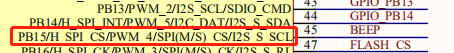
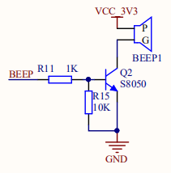
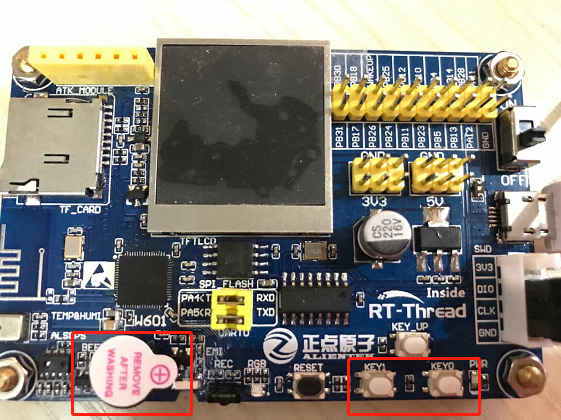

# 蜂鸣器控制例程

## 简介

本例程主要功能为使用按键控制蜂鸣器， KEY0 按键通过中断的方式控制蜂鸣器鸣叫。

## 硬件说明





如上图所示，BEEP 引脚连接单片机 PB15（45）引脚，可以通过输出高低电平控制蜂鸣器鸣叫。蜂鸣器及按键在开发板上的位置如下图所示：



## 软件说明

闪灯的源代码位于 `/examples/04_basic_beep/applications/main.c` 中。定义了宏 `PIN_KEY0`  , KEY0 与单片机 `35` 号引脚相对应，BEEP 与单片机 `45` 号引脚相对应。

```c
#define PIN_KEY0      (35)
#define PIN_BEEP      (45)
```

在 main 函数中，设置单片机 KEY0 引脚为中断方式触发，设置输入模式，设置中断触发方式与中断回调函数，使能中断。设置单片机 BEEP 引脚为输出模式，并默认输出低电平，使蜂鸣器在上电后默认处于不鸣叫的状态。

```c
int main(void)
{
    /* 设置 KEY0 引脚为输入模式 */
    rt_pin_mode(PIN_KEY0, PIN_MODE_INPUT);
    /* KEY0 引脚绑定中断回调函数 */
    rt_pin_attach_irq(PIN_KEY0, PIN_IRQ_MODE_RISING_FALLING, beep_ctrl, RT_NULL);
    /* 使能中断 */
    rt_pin_irq_enable(PIN_KEY0, PIN_IRQ_ENABLE);
    
    /* 设置 BEEP 引脚为输出模式 */
    rt_pin_mode(PIN_BEEP, PIN_MODE_OUTPUT);
    /* 默认蜂鸣器不鸣叫 */
    rt_pin_write(PIN_BEEP, PIN_LOW);

    return 0;
}
```

当中断触发时，会执行中断回调函数，控制蜂鸣器。在中断触发时，通过读取 KEY0 引脚的电平确定当前按键是否按下，当按键按下时（低电平）使蜂鸣器鸣叫，打印相应的信息 `KEY0 pressed. beep on`，当松开按键时（高电平）使蜂鸣器不工作，打印相应的信息 `beep off`。

```c
void beep_ctrl(void *args)
{
    if(rt_pin_read(PIN_KEY0) == PIN_LOW)
    {
        rt_pin_write(PIN_BEEP, PIN_HIGH);
        LOG_D("KEY0 pressed. beep on");
    }
    else
    {
        rt_pin_write(PIN_BEEP, PIN_LOW);  
        LOG_D("beep off");        
    }
}
```

## 运行

### 编译 & 下载

- **MDK**：双击 `project.uvprojx` 打开 MDK5 工程，执行编译。

编译完成后，将固件下载至开发板。

### 运行效果

按下复位按键重启开发板，按住 KEY0 可以听到蜂鸣器鸣叫；松开按键，蜂鸣器不鸣叫。

此时也可以在 PC 端使用终端工具打开开发板的 `uart0` 串口，设置 `115200-8-1-N` 。开发板的运行日志信息即可实时输出出来。

```shell
[D/main] KEY0 pressed. beep on
[D/main] beep off
[D/main] KEY0 pressed. beep on
[D/main] beep off
```

## 注意事项

如果想要修改 PIN_KEY0 或者 PIN_BEEP 宏定义，可以参考 /drivers/pin_map.c 文件，该文件中里有定义单片机的其他引脚编号。

## 引用参考

- 《通用GPIO设备应用笔记》: docs/AN0002-RT-Thread-通用 GPIO 设备应用笔记.pdf
- 《RT-Thread 编程指南》: docs/RT-Thread 编程指南.pdf
