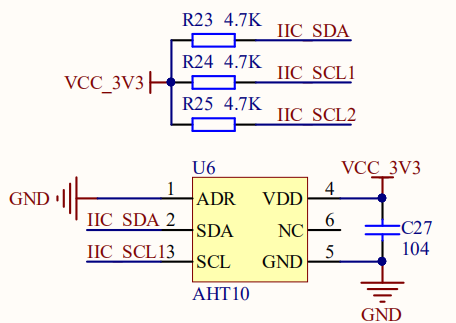
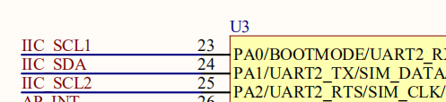
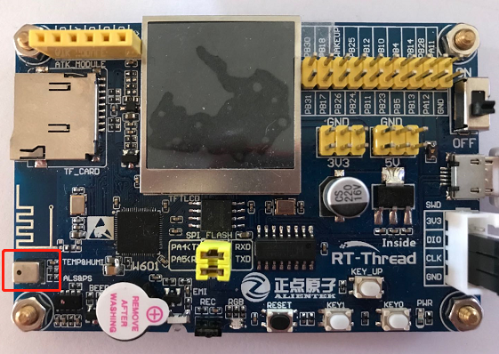

# AHT10 温湿度传感器例程

## 简介

本例程主要功能是利用 RT-Thread 的 AHT10 软件包的读取传感器 `aht10` 所测量的温度（temperature）与湿度（humidity）。

## AHT10 软件包简介

AHT10 软件包提供了使用温度与湿度传感器 `aht10` 基本功能，并且提供了软件平均数滤波器可选功能，如需详细了解该软件包，请参考 AHT10 软件包中的 [README](https://github.com/RT-Thread-packages/aht10/blob/master/README.md)。

## 硬件说明

`aht10` 硬件原理图如下所示：





如上图所示，单片机通过 IIC_SDA(PA1)、IIC_SCL1(PA0) 对传感器 `aht10` 发送命令、读取数据等。

温度与湿度传感器在开发板中的位置如下图所示：



该传感器输入电压范围为 `1.8v - 3.3v`，测量温度与湿度的量程、精度如下表所示：

| 功能 | 量程         | 精度    | 单位 |
| ---- | ------------ | ------- |-----|
| 温度 | -40 到 85 | ±0.5 |摄氏度|
| 相对湿度 | 0 到 100 | ±3   |%|

## 软件说明

温度与湿度传感器的示例代码位于 `/examples/07_driver_temp_humi/applications/main.c` 中，在 `/examples/07_driver_temp_humi/ports/sensors/sensor_port.c` 中有移植代码。

首先在 `sensor_port.c` 中已经完成了设备配置与初始化。设置 dev_name 为 i2c1soft ，设置 user_data 为该传感器的设备地址 AHT10_I2C_ADDR，该地址定义在 aht10 软件包的 sensor_asair_aht10.h 中。

```c
#include "sensor_asair_aht10.h"

#define AHT10_I2C_BUS  "i2c1soft"

int rt_hw_aht10_port(void)
{
    struct rt_sensor_config cfg;

    cfg.intf.dev_name  = AHT10_I2C_BUS;
    cfg.intf.user_data = (void *)AHT10_I2C_ADDR;

    rt_hw_aht10_init("aht10", &cfg);

    return RT_EOK;
}
INIT_ENV_EXPORT(rt_hw_aht10_port);
```

接着是 `main.c` 中的用户代码，由于在 rt_hw_aht10_init() 函数中注册了两个传感器设备，分别叫做 temp_aht 与 humi_aht，所以在查找设备时，首先寻找温度传感器 `temp_aht` ，然后打开温度传感器设备；接着寻找湿度传感器 `humi_aht` ，然后打开湿度传感器设备；最后每隔 1s 读取 1 次温湿度数据，共读取 20 次。在这过程中使用了 `rt_device_find()` ， `rt_device_open()` ， `rt_device_read()` 。


```c
#define TEMP_DEV       "temp_aht"
#define HUMI_DEV       "humi_aht"

int main(void)
{
    int count = 0;
    rt_device_t temp_dev, humi_dev;    
    static struct rt_sensor_data temp_dev_data, humi_dev_data;

    LOG_D("Temperature and Humidity Sensor Testing Start...");
    rt_thread_mdelay(2000);
    
    /* 寻找并打开温度传感器 */
    temp_dev = rt_device_find(TEMP_DEV);
    if(temp_dev == RT_NULL)
    {
        LOG_E("can not find TEMP device: %s", TEMP_DEV);   
        return RT_ERROR;
    }
    else
    {
        if (rt_device_open(temp_dev, RT_DEVICE_FLAG_RDONLY) != RT_EOK)
        {
            LOG_E("open TEMP device failed!");
            return RT_ERROR;
        }
    }
    
    /* 寻找并打开湿度传感器 */
    humi_dev = rt_device_find(HUMI_DEV);
    if(humi_dev == RT_NULL)
    {
        LOG_E("can not find HUMI device: %s", HUMI_DEV);   
        return RT_ERROR;
    }
    else
    {
        if (rt_device_open(humi_dev, RT_DEVICE_FLAG_RDONLY) != RT_EOK)
        {
            LOG_E("open HUMI device failed!");
            return RT_ERROR;
        }    
    }
    
    while (count++ < 20)
    {
        rt_device_read(temp_dev, 0, &temp_dev_data, 1);                
        LOG_D("temperature: %d.%d C", (int)(temp_dev_data.data.temp / 10), (int)(temp_dev_data.data.temp % 10));
        
        rt_device_read(humi_dev, 0, &humi_dev_data, 1);
        LOG_D("humidity   : %d.%d %%", (int)(humi_dev_data.data.humi / 10), (int)(humi_dev_data.data.humi % 10));
        
        rt_thread_mdelay(1000);
    }
    
    rt_device_close(temp_dev);
    rt_device_close(humi_dev);
    LOG_D("Temperature and Humidity Sensor Testing Ended.");
    
    return RT_EOK;
}
```

### 编译&下载

- **MDK**：双击 `project.uvprojx` 打开 MDK5 工程，执行编译。

编译完成后，将固件下载至开发板。

### 运行效果

烧录完成后，此时也可以在 PC 端使用终端工具打开开发板的 `uart0` 串口，设置 `115200-8-1-N` 。开发板的运行日志信息即可实时输出出来。

```shell
 \ | /
- RT -     Thread Operating System
 / | \     4.0.1 build May 15 2019
 2006 - 2019 Copyright by rt-thread team
[D/soft_i2c] software simulation i2c1soft init done, pin scl: 23, pin sda 24
[I/sensor] rt_sensor init success
[I/sensor] rt_sensor init success
[D/main] Temperature and Humidity Sensor Testing Start...  
msh >[D/main] temperature: 30.4 C
[D/main] humidity   : 54.0 %
[D/main] temperature: 30.4 C
[D/main] humidity   : 53.9 %
[D/main] temperature: 30.5 C
[D/main] humidity   : 53.8 %
...
[D/main] Temperature and Humidity Sensor Testing Ended.  
```

## 注意事项

请使用 aht10-v2.0.0 版本软件包，此软件包已经对接了 sensor 框架。

## 引用参考

- 《RT-Thread 编程指南》: docs/RT-Thread 编程指南.pdf
- 《I2C 设备应用笔记》: docs/AN0003-RT-Thread-I2C 设备应用笔记
- 《aht10 软件包介绍》：[https://github.com/RT-Thread-packages/aht10](https://github.com/RT-Thread-packages/aht10)


