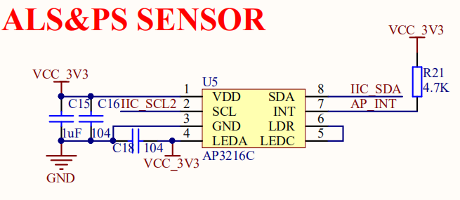
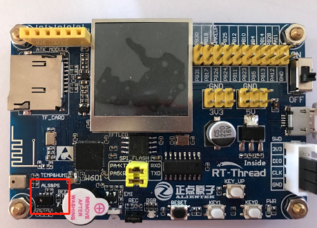

# AP3216C 接近与光强传感器例程 

## 简介

本例程主要功能是利用 RT-Thread 的 AP3216C 软件包读取传感器 `ap3216c` 测量的接近感应（ps，proximity sensor）与光照强度（als，ambient light sensor）。

## AP3216C 软件包简介

AP3216C 软件包提供了使用接近感应（ps）与光照强度（als）传感器 `ap3216c` 基本功能，并且提供了硬件中断的可选功能，如需详细了解该软件包，请参考 AP3216C 软件包中的 [README](https://github.com/RT-Thread-packages/ap3216c/blob/master/README.md)。

## 硬件说明

`ap3216c` 硬件原理图如下所示：




如上图所示，单片机通过 IIC_SDA(PA1)、IIC_SCL2(PA2) 对传感器 `ap3216c` 发送命令、读取数据等，AP_INT(PA3) 为硬件中断引脚。

接近感应与光照强度传感器在开发板中的位置如下图所示：



该传感器能够实现如下功能：

- **光照强度** ：支持 4 个量程
- **接近感应** ：支持 4 种增益

## 软件说明

接近感应与光照强度传感器 `ap3216c` 的示例代码位于 `/examples/08_driver_als_ps/applications/main.c` 中，主要流程：

1. 查找并打开光照强度传感器设备；
2. 查找并打开接近感应传感器设备；
3. 读取两个设备的数据各 20 次；
4. 关闭两个设备。

示例代码如下：

```c
int main(void)
{
    int count = 0;
    rt_device_t als_dev, ps_dev;
    struct rt_sensor_data als_dev_data, ps_dev_data;

    LOG_D("Als Ps Sensor Testing Start...");
    
    /* 查找并打开光强传感器 */
    als_dev = rt_device_find(ALS_DEV);
    if (als_dev == RT_NULL)
    {
        LOG_E("can not find ALS device: %s", ALS_DEV);
        return -RT_ERROR;
    }
    else
    {
        if (rt_device_open(als_dev, RT_DEVICE_FLAG_RDONLY) != RT_EOK)
        {
            LOG_E("open ALS device failed!");
            return -RT_ERROR;
        }
    }

    /* 查找并打开接近传感器 */
    ps_dev = rt_device_find(PS_DEV);
    if (ps_dev == RT_NULL)
    {
        LOG_E("can not find PS device: %s", PS_DEV);
        return -RT_ERROR;
    }
    else
    {
        if (rt_device_open(ps_dev, RT_DEVICE_FLAG_RDONLY) != RT_EOK)
        {
            LOG_E("open PS device failed!");
            return -RT_ERROR;
        }
    }

    /* 开始读取传感器数据 */
    while (count++ < 20)
    {
        rt_device_read(als_dev, 0, &als_dev_data, 1);
        LOG_D("current brightness: %d.%d(lux).", (int)(als_dev_data.data.light / 10), (int)(als_dev_data.data.light % 10));

        rt_device_read(ps_dev, 0, &ps_dev_data, 1);
        if (ps_dev_data.data.proximity == 0)
        {
            LOG_D("no object approaching.");
        }
        else
        {
            LOG_D("current ps data   : %d.", ps_dev_data.data.proximity);
        }

        rt_thread_mdelay(1000);
    }
    
    rt_device_close(als_dev);
    rt_device_close(ps_dev);
    LOG_D("Als Ps Sensor Testing Ended.");

    return RT_EOK;
}
```

### 编译&下载

- **MDK**：双击 `project.uvprojx` 打开 MDK5 工程，执行编译。

编译完成后，将固件下载至开发板。

### 运行效果

烧录完成后，此时也可以在 PC 端使用终端工具打开开发板的 `uart0` 串口，设置 `115200-8-1-N` 。开发板的运行日志信息即可实时输出出来。

```shell
  \ | /                                                                          
- RT -     Thread Operating System                                              
 / | \     4.0.1 build May 31 2019                                              
 2006 - 2019 Copyright by rt-thread team                                        
[D/soft_i2c] software simulation i2c2soft init done, pin scl: 25, pin sda 24    
[I/sensor] rt_sensor init success                                               
[I/sensor] rt_sensor init success  
[D/main] Als Ps Sensor Testing Start...  
[D/main] current brightness: 8.7(lux).                                          
[D/main] current ps data   : 14.                                                
msh >[D/main] current brightness: 8.7(lux).                                     
[D/main] current ps data   : 14.                                                
[D/main] current brightness: 8.7(lux).                                          
[D/main] current ps data   : 13.                                                
[D/main] current brightness: 8.7(lux).                                          
[D/main] current ps data   : 14.                                                
[D/main] current brightness: 8.7(lux).                                          
[D/main] current ps data   : 17.                                                
[D/main] current brightness: 8.7(lux).                                          
[D/main] current ps data   : 16.                                                
[D/main] current brightness: 8.7(lux).                                          
[D/main] current ps data   : 16.    
...
[D/main] Als Ps Sensor Testing Ended. 
```

## 注意事项

使用 ap3216c-v2.0.0 版本软件包，此软件包已经对接了 sensor 框架。

## 引用参考

- 《RT-Thread 编程指南》: docs/RT-Thread 编程指南.pdf
- 《I2C 设备应用笔记》: docs/AN0003-RT-Thread-I2C 设备应用笔记
- 《ap3216c 软件包介绍》：[https://github.com/RT-Thread-packages/ap3216c](https://github.com/RT-Thread-packages/ap3216c)