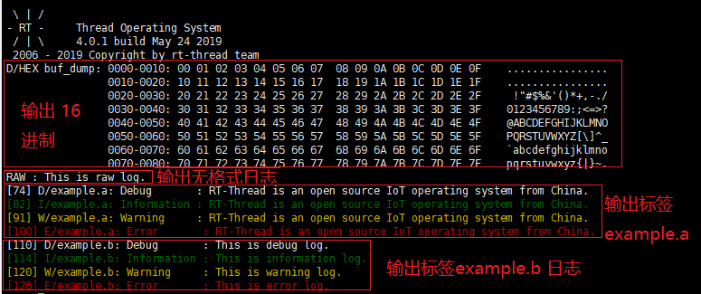

# 日志系统例程

本例程介绍如何使用 `ulog` 日志，详细介绍其使用方法以及部分常用功能。

## 简介

ulog 是一个非常简洁、易用的 C/C++ 日志组件，能做到最低 **ROM<1K, RAM<0.2K** 的资源占用。ulog 不仅有小巧体积，同样也有非常全面的功能，其设计理念参考的是另外一款 C/C++ 开源日志库：EasyLogger（简称 elog），并在功能和性能等方面做了非常多的改进。主要特性如下：

- 日志输出的后端多样化，可支持例如：串口、网络，文件、闪存等后端形式
- 日志输出被设计为线程安全的方式，并支持异步输出模式
- 日志系统高可靠，在中断 ISR 、Hardfault 等复杂环境下依旧可用
- 日志支持运行期 / 编译期设置输出级别
- 日志内容支持按关键词及标签方式进行全局过滤
- API 和日志格式可兼容 linux syslog
- 支持以 hex 格式 dump 调试数据到日志中
- 兼容 rtdbg （RTT 早期的日志头文件）及 EasyLogger 的日志输出 API

## ulog 常规使用说明

`ulog` 功能强大，例程仅介绍常规使用方法，更多使用介绍与方法，请参考《ulog 日志组件应用笔记 - 基础篇》《ulog 日志组件应用笔记 - 进阶篇》。

以下说明对应例程文件位于 `/examples/13_component_ulog/applications/ulog_example_a.c` 。

### 日志标签

日志输出量比较大的情况下，使用标签（tag）给每条日志进行分类，避免日志杂乱无章。标签的定义是按照**模块化**的方式，每条日志的标签属性也可以被输出并显示出来，同时 ulog 还可以设置每个标签（模块）对应日志的输出级别，可以根据标签进行关闭。

在文件顶部有定义 `LOG_TAG` 宏：

```c
#define LOG_TAG     "example.a"     // 该模块对应的标签，一般不同文件标签不一样
#define LOG_LVL     LOG_LVL_DBG     // 该模块对应的日志输出级别，默认为调试级别
#include <ulog.h>                   // 必须在 LOG_TAG 与 LOG_LVL 下面
```

- 定义日志标签必须位于 `#include <ulog.h>` 的上方，否则会使用默认的 `NO_TAG` 与 `LOG_LVL_DBG`

- 日志标签的作用域是当前源码文件

### 日志级别

日志级别代表了日志的重要性，在 ulog 中由高到低，有如下几个日志级别：

| **级别**        | **名称** | **描述**                                                     |
| --------------- | -------- | ------------------------------------------------------------ |
| LOG_LVL_ASSERT  | 断言     | 发生无法处理、致命性的的错误，以至于系统无法继续运行的断言日志 |
| LOG_LVL_ERROR   | 错误     | 发生严重的、**不可修复**的错误时输出的日志属于错误级别日志   |
| LOG_LVL_WARNING | 警告     | 出现一些不太重要的、具有**可修复性**的错误时，会输出这些警告日志 |
| LOG_LVL_INFO    | 信息     | 给本模块上层使用人员查看的重要提示信息日志，例如：初始化成功，当前工作状态等。该级别日志一般在量产时依旧**保留** |
| LOG_LVL_DBG     | 调试     | 给本模块开发人员查看的调试日志，该级别日志一般在量产时**关闭** |

在文件中代码如下

```c
void ulog_example_a(void)
{
    char *RTOS = "RT-Thread is an open source IoT operating system from China.";

    /* 输出不同级别的日志 */
    LOG_D("Debug       : %s", RTOS);  /* 调试日志 */
    LOG_I("Information : %s", RTOS);  /* 信息日志 */
    LOG_W("Warning     : %s", RTOS);  /* 警告日志 */
    LOG_E("Error       : %s", RTOS);  /* 错误日志 */
}
```

- 注：断言使用 `ASSERT(表达式)` ，触发后系统会停止运行

### 其他

`LOG_RAW` 输出不带任何格式的日志，不支持过滤；

`LOG_HEX` 日志为 DEBUG 级别，支持运行期的级别过滤与标签过滤


## 硬件说明

`ulog` 日志系统例程使用串口输入输出功能，无其他依赖。

## 运行

### 编译&下载

- **MDK**：双击 `project.uvprojx` 打开 MDK5 工程，执行编译。
- **IAR**：双击 `project.eww` 打开 IAR 工程，执行编译。

编译例程代码，然后将固件下载至开发板。

### 运行效果



### 按级别全局过滤

初始日志为 LOG_LVL_DBG 等级，对应的等级值为 7，对应的值可以通过命令 `ulog_lvl` 进行查询。下面将 `log` 等级设置为警告等级，则**低于设定级别**的日志都将停止输出，运行 `ulog_example_a`，如下

```c
msh >ulog_lvl 4         # 设置日志等级
msh >ulog_example_a     # 执行 ulog_example_a 命令
[1638330] W/example.a: Warning     : RT-Thread is an open source IoT operating system from China.
[1638339] E/example.a: Error       : RT-Thread is an open source IoT operating system from China.
msh >     
```

从上面日志可以看出，仅显示了日志等级大于或在等于 LOG_LVL_WARNING 的日志。

### 按关键词全局过滤

初始日志，过滤关键词为空，显示全部 `log`。如果查看某些特定的关键词，可以使用命令格式： `ulog_kw [keyword]` 进行过滤。下面关键词设为`Warning`，则仅**包含 Warning**的日志都可以输出，运行 `ulog_example_a`，如下

```c
msh >ulog_kw Warning             # 设置过滤关键词为 Warning
msh >ulog_example_a
[12961568] W/example.a: Warning     : RT-Thread is an open source IoT operating system from China.
```

### 其他常用命令

**按模块的级别过滤**：`ulog_tag_lvl <tag> <level>`

**按标签全局过滤**： `ulog_tag [tag]`

如果想了解更多详细内容，请参考《ulog 日志组件应用笔记 - 基础篇》与《ulog 日志组件应用笔记 - 进阶篇》。

## 注意事项

- 建议堆栈多预留 250 字节，系统运行崩溃
- 注意打开控制台后端，避免无输出日志
- 日志内容超出设定的日志的最大宽度，导致日志内容末尾缺失
- `LOG_TAG` 默认为 `LOG_LVL` ，`LOG_LVL` 默认为 `LOG_LVL_DBG` 


## 引用参考

- 《RT-Thread 编程指南 》: docs/RT-Thread 编程指南.pdf
- 《ulog 日志组件应用笔记 - 基础篇》: docs/AN0022-RT-Thread-ulog 日志组件应用笔记 - 基础篇.pdf
- 《ulog 日志组件应用笔记 - 进阶篇》: docs/AN0024-RT-Thread-ulog 日志组件应用笔记 - 进阶篇.pdf
