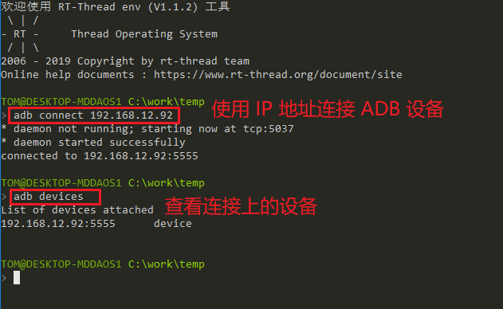
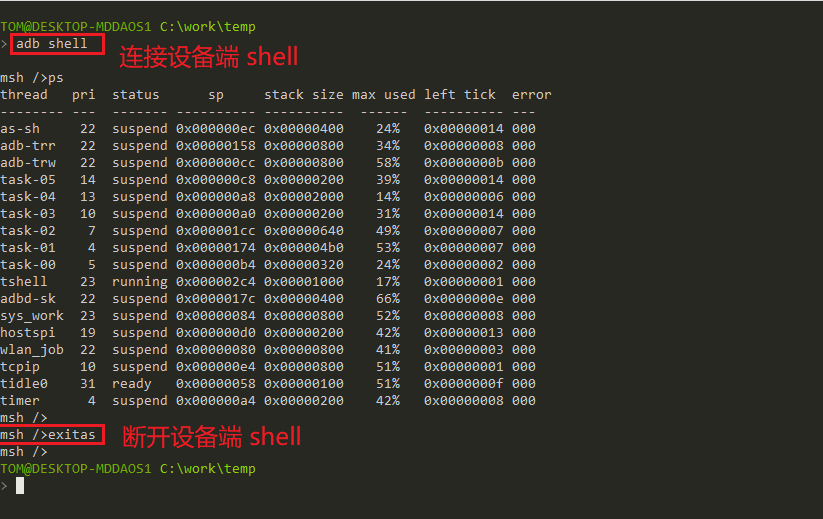
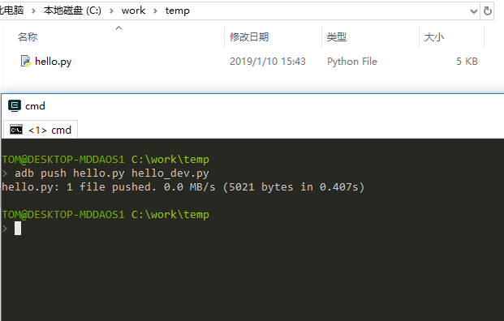
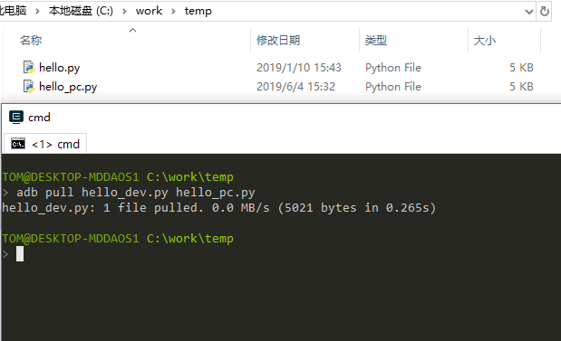
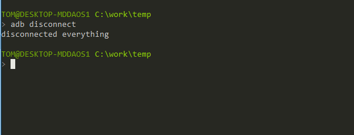

# ADB 远程调试工具例程

本例程演示如何在 PC 端使用 ADB 工具发送和读取文件，远程 Shell 控制等功能。

## 工具简介

ADB 的全称为 Android Debug Bridge，是用于调试 Android 程序的 debug 工具。经过社区开发者的移植，在 RT-Thread 上也支持该工具。直接拉取 ADBD 软件包，使用 USB 或网络连接后，即可使用。

## 主要功能

- 文件同步

将 PC 端的文件同步到设备指定目录下。支持单文件同步与目录同步两种方式。同步完成后，设备端文件与 PC 端保持一致。

- 远程 Shell

在 ADB 工具中远程连接 Shell，用户无需连接串口设备即可完成对设备的控制、管理，满足用户对设备远程管理的需求。

- 自定义扩展模块

将远端路径封装，实现命令功能自定义。通过相应的脚本，可自由进行功能扩展。

## 硬件说明

本例程需要依赖 WiFi 功能完成网络通信，因此请确保硬件平台上的 WiFi 功能可以正常工作，并且能够连接网络。

## 配置说明

```base
[*]   Using TCPIP transfer                          # 启用 TCP/IP 传输数据
[ ]   Using USB transfer                            # 启动 USB 传输数据
(2048) Set transfer thread stack size               # 设置传输线程栈大小
[*]   Enable Shell service                          # 开启 Shell 服务
-*-   Enable File service                           # 开启 文件 服务
(2304)  Set file service thread stack size          # 设置文件服务线程栈大小
(2000)  Set file service receive timeout(ms)        # 设置文件接收超时时间
[*]   Enable external MOD                           # 使能外部模块
[*]     Enable File SYNC Mod                        # 启用文件同步模块，支持校验MD5，跳过相同文件
[*]     Enable File LIST Mod  --->                  # 启用获取文件目录模块
[ ]   Enable ADB service discovery                  # 启用局域网发现服务
     Version (v1.1.0)  --->
```

## 软件说明

ADB 例程代码位于 `/examples/14_component_adbd/application/` 文件夹中，其中 main.c 主要完成文件系统的初始化，wlan 配置初始化，并等待设备联网成功。程序如下所示：

```c
int main(void)
{
    rt_device_t flash_dev;
    /* 初始化分区表 */
    fal_init();
    /* 初始化 easyflash */
    easyflash_init();

    /* 配置 wifi 工作模式 */
    rt_wlan_set_mode(RT_WLAN_DEVICE_STA_NAME, RT_WLAN_STATION);

    /* 初始化自动连接配置 */
    wlan_autoconnect_init();
    /* 使能 wlan 自动连接 */
    rt_wlan_config_autoreconnect(RT_TRUE);

    /* 在 filesystem 分区上创建一个 Block 设备 */
    flash_dev = fal_blk_device_create(FS_PARTITION_NAME);
    if (flash_dev == NULL)
    {
        LOG_E("Can't create a Block device on '%s' partition.", FS_PARTITION_NAME);
    }

    /* 挂载 FAT32 文件系统 */
    if (dfs_mount(FS_PARTITION_NAME, "/", "elm", 0, 0) == 0)
    {
        LOG_I("Filesystem initialized!");
    }
    else
    {
        /* 创建 FAT32 文件系统 */
        dfs_mkfs("elm", FS_PARTITION_NAME);
        /* 再次挂载 FAT32 文件系统 */
        if (dfs_mount(FS_PARTITION_NAME, "/", "elm", 0, 0) != 0)
        {
            LOG_E("Failed to initialize filesystem!");
        }
    }
    return 0;
}
```

## 运行

### 编译 & 下载

- **MDK**：双击 `project.uvprojx` 打开 MDK5 工程，执行编译。

编译完成后，将固件下载至开发板。

### 运行效果

在 PC 端使用终端工具打开开发板的 `uart0` 串口，设置 115200 8 1 N 。正常运行后，终端输出信息如下：

```shell
 \ | /
- RT -     Thread Operating System
 / | \     4.0.1 build Jun  3 2019
 2006 - 2019 Copyright by rt-thread team
lwIP-2.0.2 initialized!
[SFUD] Find a Winbond flash chip. Size is 16777216 bytes.
[SFUD] w25q128 flash device is initialize success.
[I/sal.skt] Socket Abstraction Layer initialize success.
[D/FAL] (fal_flash_init:63) Flash device |              w60x_onchip | addr: 0x08
000000 | len: 0x00100000 | blk_size: 0x00001000 |initialized finish.
[D/FAL] (fal_flash_init:63) Flash device |                 norflash | addr: 0x00
000000 | len: 0x01000000 | blk_size: 0x00001000 |initialized finish.
[D/FAL] (fal_partition_init:176) Find the partition table on 'w60x_onchip' offse
t @0x0000f0c8.
[I/FAL] ==================== FAL partition table ====================
[I/FAL] | name       | flash_dev   |   offset   |    length  |
[I/FAL] -------------------------------------------------------------
[I/FAL] | easyflash  | norflash    | 0x00000000 | 0x00100000 |
[I/FAL] | app        | w60x_onchip | 0x00010100 | 0x000ed800 |
[I/FAL] | download   | norflash    | 0x00100000 | 0x00100000 |
[I/FAL] | font       | norflash    | 0x00200000 | 0x00700000 |
[I/FAL] | filesystem | norflash    | 0x00900000 | 0x00700000 |
[I/FAL] =============================================================
[I/FAL] RT-Thread Flash Abstraction Layer (V0.3.0) initialize success.
[Flash] EasyFlash V3.3.0 is initialize success.
[Flash] You can get the latest version on https://github.com/armink/EasyFlash . 
[I/WLAN.dev] wlan init success
[I/WLAN.lwip] eth device init ok name:w0
[I/FAL] The FAL block device (filesystem) created successfully
[I/main] Filesystem initialized!
msh />[I/WLAN.mgnt] wifi connect success ssid:aptest
[I/WLAN.lwip] Got IP address : 192.168.12.102
```

### 连接 ADB 设备

程序运行之后，网络连接成功并获得 IP 地址之后，在 env 终端中输入 `adb connect ip地址` 命令连接开发板。等待命令执行完成后，输入 `adb devices` 命令查看已经连接的设备。



### ADB Shell 功能

ADB 连接设备成功之后，在 env 终端中输入 `adb shell` 命令，进入开发板终端。此时即可实现远程 Shell 控制功能，用户无需连接串口设备即可完成设备的管理和调试，并且实时显示设备打印信息。输入 `exitas` 命令，退出远程 Shell。



### 文件推送功能

文件推送功能是将 PC 端的文件或目录，传输到设备上。相关的命令为： `adb push LOCAL... REMOTE`。其中 `LOCAL` 表示 PC 端文件名或目录。`REMOTE` 表示发送到设备之后的文件名或目录。

例如：将 PC 的 hello.py 文件推送到设备根目录下，并命名为 hello_dev.py，在命令行输入 `adb push hello.py hello_dev.py` 即可完成。 



传输文件完成之后，在设备端输入 `ls` 命令，查看文件。可以看到 PC 端推送过来的文件。


### 文件拉取功能

文件拉取功能是将设备端的文件或目录，传输到 PC 上。相关的命令为： `adb pull REMOTE... LOCAL`。其中 `REMOTE` 表示设备端的文件名或目录。`LOCAL` 发送到 PC 端之后文件名或目录。

例如：将设备端的 hello_dev.py 文件传输到 PC 上，并命名为 hello_pc.py，在命令行输入 `adb pull hello_dev.py hello_pc.py` 即可完成。



### 断开 ADB 设备

在 env 终端中，输入 `adb disconnect` 命令，断开所有连接的设备。



## 注意事项

本例程需要连接 WIFI ，开始例程之前确保 WIFI 已经连接并获取到 IP 地址。例程中已经启动 WIFI 自动连接功能，如果等待一段时间后，仍没有连接成功，则需要手动连接。使用 MSH 命令 `wifi join <ssid> <password>` 可让设备接入网络。

## 引用参考

- 《RT-Thread 编程指南》: docs/RT-Thread 编程指南.pdf
