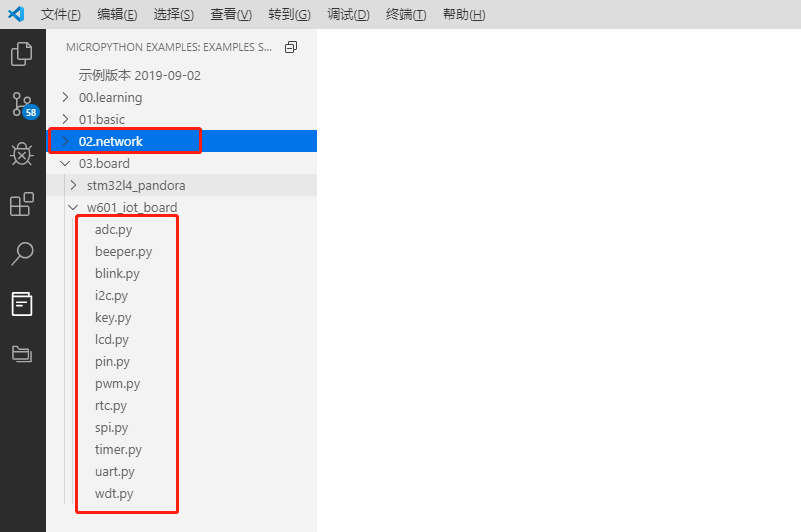

# 使用 MicroPython 控制硬件

## 简介

MicroPython 是 Python 3 编程语言的一种精简而高效的实现，它包含 Python 标准库的一个子集，并被优化为在微控制器和受限环境中运行。它具有交互式提示、任意精度整数、闭包函数、列表解析、生成器、异常处理等高级特性，具有很强的可移植性。它能够帮助开发者快速控制各种硬件外设，不用再去研究底层硬件模块的使用方法，翻看寄存器手册。降低了开发难度，而且减少了重复开发工作，可以加快开发速度，提高开发效率。

本例程作将介绍如何在 rt-thread 上使用 MicroPython，并通过命令行展示 MicroPython 代码的输入与运行，最后将演示使用 MicroPython 控制硬件。

## 硬件说明

本例程将演示点亮 LED 灯、连接 WIFI、LCD 绘图等功能，因此请确保各个硬件能够正常工作。

## 软件说明

main 程序代码位于 `examples/15_component_micropython/applications/main.c` 中, 主要是为 MicroPython 的提供必要的运行环境。

在 main 函数中，主要完成以下几个任务：

- 创建 Block 设备

- 挂载 FAT32 文件系统

- 打开 MicroPython 命令交互界面

main 函数代码如下所示

```c
int main(void)
{
    rt_device_t flash_dev;
    /* 初始化分区表 */
    fal_init();

    /* 配置 wifi 工作模式 */
    rt_wlan_set_mode(RT_WLAN_DEVICE_STA_NAME, RT_WLAN_STATION);
    rt_wlan_set_mode(RT_WLAN_DEVICE_AP_NAME, RT_WLAN_AP);

    /* 在 filesystem 分区上创建一个 Block 设备 */
    flash_dev = fal_blk_device_create(FS_PARTITION_NAME);
    if (flash_dev == NULL)
    {
        LOG_E("Can't create a Block device on '%s' partition.", FS_PARTITION_NAME);
    }

    /* 挂载 FAT32 文件系统 */
    if (dfs_mount(FS_PARTITION_NAME, "/", "elm", 0, 0) == 0)
    {
        LOG_I("Filesystem initialized!");
    }
    else
    {
        LOG_W("make fs and Try mount!");
        /* 创建 FAT32 文件系统 */
        dfs_mkfs("elm", FS_PARTITION_NAME);
        /* 再次挂载 FAT32 文件系统 */
        if (dfs_mount(FS_PARTITION_NAME, "/", "elm", 0, 0) != 0)
        {
            LOG_E("Failed to initialize filesystem!");
        }
    }

    /* 等待系统初始化完毕 */
    rt_thread_mdelay(100);

    /* 打开 MicroPython 命令交互界面 */
    extern void mpy_main(const char *filename);
    mpy_main(NULL);

    LOG_D("MicroPython will reset by user");
    rt_hw_cpu_reset();

    return 0;
}
```

## 运行

### 编译&下载

- **MDK**：双击 `project.uvprojx` 打开 MDK5 工程，执行编译。
- **IAR**：双击 `project.eww` 打开 IAR 工程，执行编译。

编译完成后，将固件下载至开发板。

### 运行效果

在 PC 端使用终端工具打开开发板的 `uart0` 串口，设置 115200 8 1 N 。正常运行后，终端输出信息如下：

```shell
 \ | /
- RT -     Thread Operating System
 / | \     4.0.1 build Jun 10 2019
 2006 - 2019 Copyright by rt-thread team
lwIP-2.0.2 initialized!
[SFUD] Find a Winbond flash chip. Size is 16777216 bytes.
[SFUD] w25q128 flash device is initialize success.
[19] I/sal.skt: Socket Abstraction Layer initialize success.
[I/FAL] RT-Thread Flash Abstraction Layer (V0.3.0) initialize success.
[617] I/WLAN.dev: wlan init success
[685] I/WLAN.lwip: eth device init ok name:w0
[690] I/WLAN.dev: wlan init success
[758] I/WLAN.lwip: eth device init ok name:w1
[I/FAL] The FAL block device (filesystem) created successfully
[777] I/main: Filesystem initialized!
msh />
MicroPython v1.10-145-ged1a88e-dirty on 2019-02-27; Universal python platform wi
th RT-Thread
Type "help()" for more information.
>>>
```

此时 MicroPython 命令交互界面就已经启动，可以通过命令行与 MicroPython 进行交互。下面将使用一个示例展示如何使用 MicroPython 控制硬件。

## MicroPython 基本功能

### Python 语法与内建函数

#### 使用 python 交互命令行

- MicroPython 是 Python 3 编程语言的一种精简而高效的实现，语法和 Python 3 相同，并带有丰富的内建函数，使用 MicroPython 交互命令行即可运行 Python 代码。

在交互命令行输入 `print('hello RT-Thread!')` ，然后输入回车，将运行这行语句，在下一行输出 hello RT-Thread! 字样。运行效果如下：


#### 交互命令行的粘贴模式

`MicroPython`  比一般的 python 交互环境多了一个特别的**粘贴模式**，可以一次粘贴输入多行 python 代码。

- 按下 `Ctrl-E` 组合键，进入粘贴模式，界面上会出现提示：`paste mode; Ctrl-C to cancel, Ctrl-D to finish` 。该模式下可一次粘贴多行代码。

- 按下 `Ctlr-D` 组合键，退出粘贴模式。同时粘贴输入的代码也会自动执行。

- 按下 `Ctrl-C` 组合键，终止正在执行的程序。

> 注意：进入粘贴模式后，不要使用 `Ctrl-C` 粘贴代码。可使用鼠标右键进行粘贴。

使用粘贴模式执行下面代码：

```python
for i in range(1,10):
    print(i)
```

执行效果如下：


#### MicroPython 内建模块

MicroPython 提供丰富的内建模块用来完成相关的程序功能。同时 RT-Thread  也提供了 `rtthread` 模块用来返回系统运行相关的信息。

- 使用 `rtthread` 模块查看当前运行线程。先输入 `import rtthread` ，导入相应的模块。然后执行 `rtthread.stacks_analyze()` 方法，查看当前运行线程。调用方法及效果如下图所示：


- 使用 `time` 模块进行毫秒延时。先输入 `import time` ，导入相应的模块。然后执行 `time.sleep(2000)` 方法，进行毫秒延时。调用方法及效果如下图所示：


### MicroPython 例程

通过 MicroPython 可以用非常简单的方式来控制开发板的硬件资源，使用几个简单的例子来说明。使用**粘贴模式**输入。使用 `Ctrl-C` 取消当前正在运行程序。

- 控制 LED 灯闪烁：开发板上第 30 号 pin 为 红色 LED 灯。下面代码使 LED 灯周期闪烁。

```python
import utime as time
from machine import Pin

PIN_LED_R = 30    # PA13, get the pin number from get_pin_number.py

# create led object from pin PIN_LED_R, Set pin PIN_LED_R to output mode
led = Pin(("led_red", PIN_LED_R), Pin.OUT_PP)

while True:
    led.value(0)  # Set led turn on
    time.sleep(0.5)
    led.value(1)  # Set led turn off
    time.sleep(0.5)
```

针对自己的开发板修改引脚号，即可看到 LED 灯按照指定的频率闪烁。

- 控制开发板连接 WIFI：开发板板载芯片是一颗 WIFI SOC。下面代码将执行连接 WIFI 的动作。

```python
import network

wlan = network.WLAN(network.STA_IF)
print(wlan.scan())

wlan.connect("test", "123456789")

if wlan.isconnected():
    print("wifi connect successful")
else:
    print("wifi connect failed")
```

其中 'your-ssid' 是 WIFI 名称，'your-password' 是 WIFI 密码。开发者根据实际情况自行修改。 

- 控制 LCD 绘制图形：下面代码将在 LCD 屏幕上绘制一些图案。

```python
from machine import LCD                 # 从 machine 导入 LCD 类

lcd = LCD()                             # 创建一个 lcd 对象
lcd.light(True)                         # 打开背光
lcd.fill(lcd.WHITE)                     # 将整个 LCD 填充为白色
lcd.text("hello RT-Thread", 0, 0, 16)   # 在（0, 0） 位置以 16 字号打印字符串
lcd.rectangle(100, 100, 200, 200)       # 以左上角为（100,100），右下角（200,200）画矩形
lcd.circle(150, 150, 80)                # 以圆心位置（150,150），半径为 80 画圆
```

除了上述示例之外，还可以使用 MicroPython 控制各种各样的硬件模块，如 `Pin、I2C、SPI、UART、LCD、RTC、PWM、ADC、WDT、TIMER` 等，想要了解这些硬件的详细控制方式，可以查阅 MicroPython 用户手册，里面有详细的介绍。

除了可以通过阅读用户手册来了解 MicroPython 的使用方式，还可以直接在 VScode 中搜索 `RT-Thread MicroPython` 来使用 RT-Thread 推出的 MicroPython 开发环境，在开发环境中直接运行示例程序来学习 MicroPython 开发。如下图所示：




## 注意事项

- 想要了解更多的 MicroPython 软件包的功能，可以查阅 MicroPython 用户手册。

## 引用参考

《RT-Thread 编程指南》: docs/RT-Thread 编程指南.pdf

《MicroPython用户手册》: <https://www.rt-thread.org/document/site/submodules/micropython/docs/>
