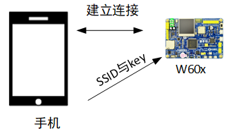
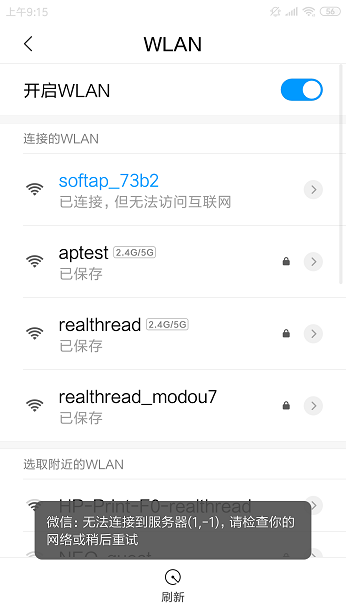
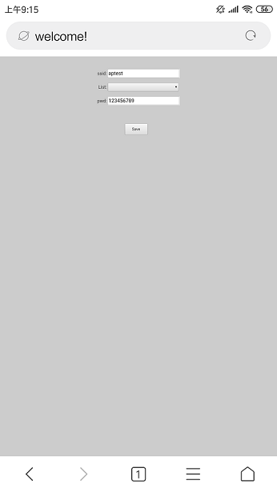
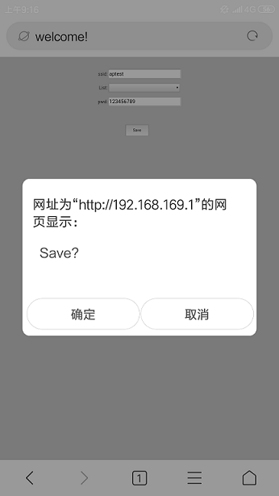

# 使用 web 快速接入 WiFi 网络

本例程基于 WM SDK 提供的库文件，主要讲解 web 配网的基本原理、配网流程以及代码实现流程。

## 原理简介

支持 AP 模式的 WiFi 设备上内嵌一个简单的 web 服务器，在 web 网页里面提供一个配网的交互接口。WiFi 设备进入 AP 模式，其他设备包括手机等通过 AP 热点建立连接。建立连接之后，通过网页将其他路由器或者 AP 的 SSID 与  key 发送给 WiFi 设备。交互流程如下图所示



## 硬件说明

web 配网使用到 WiFi 相关功能，需要手机连接 WiFi 设备之后打开网页。

## 软件说明

AirKiss 使用例程位于 `/examples/17_iot_web_config_wifi/applications/main.c` 文件中，main 函数主要配置 WiFi 工作模式与启动一键配网功能，main 函数实现功能如下

```c
int main(void)
{
    rt_err_t result = RT_EOK;
    /* 配置 wifi 工作模式 */
    rt_wlan_set_mode(RT_WLAN_DEVICE_STA_NAME, RT_WLAN_STATION);
    rt_wlan_set_mode(RT_WLAN_DEVICE_AP_NAME, RT_WLAN_AP);
    rt_sem_init(&web_sem, "web_sem", 0, RT_IPC_FLAG_FIFO);

    rt_thread_mdelay(2000);
    /* 一键配网：APWEB 模式 */
    result = wm_oneshot_start(WM_APWEB, oneshot_result_cb);
    if (result != 0)
    {
        LOG_E("web config wifi start failed");
        return result;
    }

    LOG_D("web config wifi start...");
    result = rt_sem_take(&web_sem, NET_READY_TIME_OUT);
    if (result != RT_EOK)
    {
        LOG_E("connect error or timeout");
        return result;
    };
    /* 连接 WiFi */
    result = rt_wlan_connect(ssid, passwd);
    if (result != RT_EOK)
    {
        LOG_E("\nconnect ssid %s key %s error:%d!", ssid, passwd, result);
    };
    return result;
}
```

启动一键配网函数的回调，实现了使用获取的 SSID 与 passwd 进行 WiFi 连接的功能。

```c
static void oneshot_result_cb(int state, unsigned char *ssid_i, unsigned char *passwd_i)
{
    char *ssid_temp = (char *)ssid_i;
    char *passwd_temp = (char *)passwd_i;

    /* 配网回调超时返回 */
    if (state != 0)
    {
        LOG_E("Receive wifi info timeout(%d). exit!", state);
        return;
    }
    if (ssid_temp == RT_NULL)
    {
        LOG_E("SSID is NULL. exit!");
        return;
    }
    LOG_D("Receive ssid:%s passwd:%s", ssid_temp == RT_NULL ? "" : ssid_temp, passwd_temp == RT_NULL ? "" : passwd_temp);

    strncpy(ssid, ssid_temp, strlen(ssid_temp));
    if (passwd_temp)
    {
        strncpy(passwd, passwd_temp, strlen(passwd_temp));
    }
    /* 通知 ssid 与 key 接收完成 */
    rt_sem_release(&web_sem);
}
```

## 运行

### 编译&下载

- **MDK**：双击 `project.uvprojx` 打开 MDK5 工程，执行编译。
- **IAR**：双击 `project.eww` 打开 IAR 工程，执行编译。

编译例程代码，然后将固件下载至开发板。

程序运行日志如下所示：

```c
 \ | /                                   
- RT -     Thread Operating System        
 / | \     4.0.1 build May 22 2019         
 2006 - 2019 Copyright by rt-thread team  
lwIP-2.0.2 initialized!                   
[I/sal.skt] Socket Abstraction Layer initialize success.
[I/WLAN.dev] wlan init success            
[I/WLAN.lwip] eth device init ok name:w0   
[I/WLAN.dev] wlan init success            
[I/WLAN.lwip] eth device init ok name:w1     
msh />[I/WLAN.mgnt] start ap successs!    
[D/main] oneshot start...               
[DHCP] dhcpd_start: w1         # 分配 ip              
[DHCP] ip_start: [192.168.169.2]         
[DHCP] ip_start: [192.168.169.254]
```
手机连接开发板的热点，例程中名称为 `softap_73b2`(具体的可能有所变化)，如下图所示



然后打开浏览器，输入`192.168.169.1`，浏览器进入如下界面，然后再 ssid 栏中写入将要连接的热点名称，pwd 栏中输入对应 ssid 的密码，例程中ssid 为 `aptest`，pwd 为 `123456789`，输入如下图所示



然后点击按钮 `save` -> `确定`，如下图所示



点击完成后，查看日志，显示如下

```c
[I/WLAN.mgnt] sta associated mac:f4:70:ab:72:20:66  
[I/WLAN.mgnt] sta exit mac:f4:70:ab:72:20:66  
[I/WLAN.mgnt] ap stop success!            
Receive ssid:aptest passwd:123456789            # 打印接收的 ssid 与 key
connect wifi:aptest                      
[I/WLAN.mgnt] wifi connect success ssid:aptest  
[I/WLAN.lwip] Got IP address : 192.168.12.240  
networking ready!  								# 网络连接成功
```


## 注意事项

- 待连接的路由器必须支持 2.4G


## 引用参考

- 《RT-Thread 编程指南 》: docs/RT-Thread 编程指南.pdf

- 《WM_W60X_一键配网使用指导_V1.1》：libraries/WM_Libraries/Doc/WM_W60X_一键配网使用指导_V1.1.pdf

  


