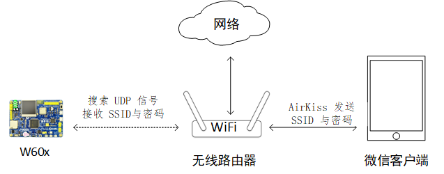

# 使用 AirKiss 快速接入 WiFi 网络

本例程将介绍 `AirKiss` 快速接入 WiFi 网络，主要讲解配网的基本原理、配网流程以及代码实现流程。

## 简介

AirKiss 是微信硬件平台提供的一种 WiFi 设备快速入网配置技术，要使用微信客户端的方式配置设备入网，且需要设备支持 AirKiss 技术。

## 原理简介

AirKiss 配置设备联网过程中，主要包含以下基本内容

- 开发板以 station 混杂模式运行
- 手机微信客户端通过 AirKiss 发送 SSID 和密码
- 开发板通过抓包获取到 SSID 和密码，然后连接 WiFI 

大致流程如下图所示



如上图所示，微信客户端将通过 AirKiss 通信协议将 WiFi 的 SSID 与密码，发送一系列的 UDP 广播包，路由器接收后进行转播，被置为 station 混杂模式的 WiFi 设备监听空中的广播包， WiFi 设备可根据 AirKiss 通信协议解析出需要的信息，获取到 SSID 与密码后进行网络连接。

更多关于 AirKiss 原理介绍参考链接 <https://iot.weixin.qq.com/wiki/new/index.html?page=4-1-1>。

## 硬件说明

AirKiss 使用到 LCD 显示二维码、WiFi 相关功能。

## 软件说明

AirKiss 使用例程位于 `/examples/18_iot_airkiss/applications` 目录下，配置 wifi 工作模式后启动一键配网功能，并且屏幕显示特定二维码图片，main 函数实现功能如下

```c
int main(void)
{
    rt_err_t result;
    /* 清屏 */
    lcd_clear(WHITE);
    /* 配置 wifi 工作模式 */
    result = rt_wlan_set_mode(RT_WLAN_DEVICE_STA_NAME, RT_WLAN_STATION);
    if (result == RT_EOK)
    {
        LOG_D("Start airkiss...");
        /* 一键配网 demo */
        smartconfig_demo();
    }
    /* 显示二维码 */
    iotb_lcd_show_wechatscan();

    return 0;
}
```

其中一键配网 demo 具体实现位于`../../libraries/smartconfig/smartconfig_demo.c`，实现函数如下

```c
void smartconfig_demo(void)
{
    rt_smartconfig_start(SMARTCONFIG_TYPE_AIRKISS, SMARTCONFIG_ENCRYPT_NONE, RT_NULL, smartconfig_result);
}
```

SMARTCONFIG_TYPE_AIRKISS 表示配网类型为 AirKiss；SMARTCONFIG_ENCRYPT_NONE 表示无加密；`smartconfig_result` 为配网回调函数，主要打印配网信息以及返回通知。

## 运行

### 编译&下载

- **MDK**：双击 `project.uvprojx` 打开 MDK5 工程，执行编译。
- **IAR**：双击 `project.eww` 打开 IAR 工程，执行编译。

编译例程代码，然后将固件下载至开发板。

程序运行日志如下所示：

```c
 \ | /      
- RT -     Thread Operating System        
 / | \     4.0.1 build May 21 2019      
 2006 - 2019 Copyright by rt-thread team  
lwIP-2.0.2 initialized!                  
[I/sal.skt] Socket Abstraction Layer initialize success.                      
[I/WLAN.dev] wlan init success             
[I/WLAN.lwip] eth device init ok name:w0  
[I/DBG] config_type:AIRKISS          # 初始化成功  
```
屏幕显示二维码，如下图所示


微信扫码，填入手机连接的 WiFi 密码，点击连接，如下图所示


连接成功后显示日志如下

```c
msh >[I/DBG] locked channel 10            
[I/DBG] ssid:aptest                      
[I/DBG] passwd:123456789                  
[I/DBG] radom:d7                          
[I/DBG] airkiss finish!                 
[I/DBG] smartconfig finish!             
type:0                                    
ssid:aptest                              
passwd:123456789                           
user_data:0xd7                           
[I/WLAN.mgnt] wifi connect success ssid:aptest   
[I/WLAN.lwip] Got IP address : 192.168.12.240    
networking ready!                       # 连接网络成功
airkiss notification thread exit!   
```

## 注意事项

- 手机需要连接使用 2.4G 的路由器


## 引用参考

- 《RT-Thread 编程指南 》: docs/RT-Thread 编程指南.pdf

- qrcode 软件包：<https://github.com/RT-Thread-packages/qrcode>

