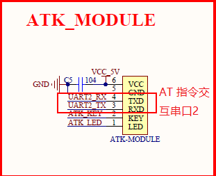
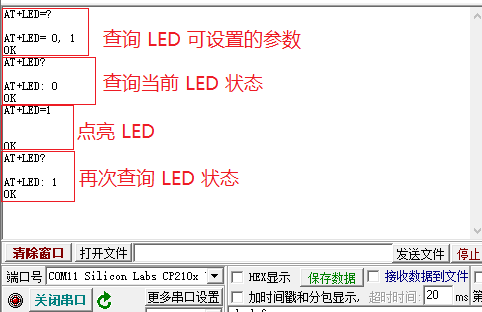

# AT 指令（服务器端）例程

本例程基于 RT-Thread 系统的 AT 组件，主要介绍如何使用 AT 服务器端，即通过添加 AT 指令，控制 LED 灯的开关。如果需要了解更多的 AT Server 使用例程，可以参考软件包 [ socket 指令的 AT 服务端](https://github.com/RT-Thread-packages/atsrv_socket)。

## 简介

AT 指令（AT Commands）最早是为了控制拨号调制解调器（MODEM）的控制协议，经过系列的发展，逐步形成了一定的标准化，但没有完全统一，很难做到对上层网络应用接口的适配。

RT-Thread 提供方便用户使用 AT 命令组件，只需要简单适配即可实现 AT Server 和 AT Client 两部分功能。该组件完成 AT 命令的发送、命令格式及参数判断、命令的响应、响应数据的接收、响应数据的解析、URC 数据处理等整个 AT 命令数据交互流程。

本例程主要使用 **AT Server**，其主要功能特点如下：

- 基础命令： 实现多种通用基础命令（ATE、ATZ 等）；
- 命令兼容： 命令支持忽略大小写，提高命令兼容性；
- 命令检测： 命令支持自定义参数表达式，并实现对接收的命令参数自检测功能；
- 命令注册： 提供简单的用户自定义命令添加方式，类似于 `finsh/msh` 命令添加方式；
- 调试模式： 提供 AT Server CLI 命令行交互模式，主要用于设备调试。

##  AT Server 使用说明

RT-Thread 的 AT 组件功能强大，例程仅使用了 AT Server 的相关功能，更详细介绍参考[《AT 组件》](https://www.rt-thread.org/document/site/programming-manual/at/at/)。

AT 命令根据功能进行划分，有如下四种格式：：

- 测试功能：`AT+<x>=?` 用于查询命令参数格式及取值范围；
- 查询功能：`AT+<x>?` 用于返回命令参数当前值；
- 设置功能：`AT+<x>=...` 用于用户自定义参数值；
- 执行功能：`AT+<x>` 用于执行相关操作。

每个命令的四种功能并不需要全部实现，用户自定义添加 AT Server 命令时，可根据自己需求实现一种或几种上述功能函数，未实现的功能可以使用 `NULL` 表示，再通过自定义命令添加函数添加到基础命令列表，添加方式类似于 `finsh/msh` 命令添加方式，添加函数如下：

```c
AT_CMD_EXPORT(_name_, _args_expr_, _test_, _query_, _setup_, _exec_);
```

| **参数**      | **描述**                                                     |
| ------------- | ------------------------------------------------------------ |
| `_name_`      | AT 命令名称                                                  |
| `_args_expr_` | AT 命令参数表达式；（无参数为 NULL，`<>` 中为必选参数，`[]` 中为可选参数） |
| `_test_`      | AT 测试功能函数名；（无实现为 NULL）                         |
| `_query_`     | AT 查询功能函数名；（同上）                                  |
| `_setup_`     | AT 设置功能函数名；（同上）                                  |
| `_exec_`      | AT 执行功能函数名；（同上）                                  |

## 硬件说明

AT 指令（服务器端）例程控制台使用串口 0，AT 指令交互使用串口 2，以及红色 LED 灯，其中串口 2 如下图所示



## 软件说明

AT server 使用例程位于 `/examples/20_iot_at_server/applications` 目录下，主要程序在 main.c 文件中，主要实现 AT 自定义命令的添加功能，完成通过 AT 指令控制灯的开关。

**自定义 AT 命令**

```c
AT_CMD_EXPORT("AT+LED", "=<value>", led_parameter, led_query, led_setup, RT_NULL);
```
| **参数**        | **描述**                                 |
| --------------- | ---------------------------------------- |
| "AT+LED"        | AT 命令名称                              |
| "=<value>"      | AT 命令参数表达式                        |
| `led_parameter` | AT 查询参数函数名，查询 LED 灯可设置状态 |
| `led_query`     | AT 查询功能函数名，获取 LED 灯的状态     |
| `led_setup`     | AT 设置功能函数名，设置 LED 灯的状态     |

**查询 LED 参数**

```c
static at_result_t led_parameter()
{
    /* 返回当前灯可设置参数到 AT 客户端 */
    at_server_printf("AT+LED= 0, 1");
    return AT_RESULT_OK;
}
```
**查询 LED  状态**

```c
static at_result_t led_query(void)
{
	/* 返回客户端获取 LED 状态 */
    at_server_printf("AT+LED: %c", led_status);
    return AT_RESULT_OK;
}
```

**开关 LED**

```c
static at_result_t led_setup(const char *args)
{
    at_result_t  result;
    /* 解析得到结果存入 led_status */
    if (at_req_parse_args(args, "=%c", &led_status) > 0)
    {
        if ('0' == led_status)
        {
            /* LED 灯灭 */
            rt_pin_write(LED_PIN, PIN_HIGH);
        }
        else
        {
            /* LED 灯亮 */
            rt_pin_write(LED_PIN, PIN_LOW);
        }
        result = AT_RESULT_OK;
    }
    else
    {
        result = AT_RESULT_PARSE_FAILE;
    }
    return result;
}
```

## 运行

### 编译&下载

- **MDK**：双击 `project.uvprojx` 打开 MDK5 工程，执行编译。
- **IAR**：双击 `project.eww` 打开 IAR 工程，执行编译。

编译例程代码，然后将固件下载至开发板。

程序运行日志（串口 0 输出）如下所示：

```shell

 \ | /
- RT -     Thread Operating System
 / | \     4.0.1 build May 16 2019
 2006 - 2019 Copyright by rt-thread team
[I/at.svr] RT-Thread AT server (V1.2.0) initialize success.
msh >
```

AT 指令串口交互命令（串口 2 命令交互）如下图所示：



## 注意事项

- 避免 AT 指令中存在空格对指令识别造成影响
- 注意问号为半角
- AT 指令交互串口与控制台是两个不同的串口


## 引用参考

- 《RT-Thread 编程指南 》: docs/RT-Thread 编程指南.pdf

- 《AT 组件》：<https://www.rt-thread.org/document/site/programming-manual/at/at/>
