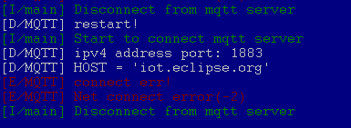

# MQTT 协议通信例程

## 简介

本例程基于 Paho-MQTT 软件包，展示了向服务器订阅主题和向指定主题发布消息的功能。

## 硬件说明

本例程需要依赖板 W601 WIFI 芯片完成网络通信。

## 软件说明

### MQTT

MQTT（Message Queuing Telemetry Transport，消息队列遥测传输协议），是一种基于发布/订阅（publish/subscribe）模式的“轻量级”通讯协议，该协议构建于 TCP/IP 协议上，由 IBM 在1999年发布。MQTT 最大优点在于，可以以极少的代码和有限的带宽，为连接远程设备提供实时可靠的消息服务。作为一种低开销、低带宽占用的即时通讯协议，使其在物联网、小型设备、移动应用等方面有较广泛的应用。

MQTT 是一个基于客户端-服务器的消息发布/订阅传输协议。MQTT 协议是轻量、简单、开放和易于实现的，这些特点使它适用范围非常广泛。在很多情况下，包括受限的环境中，如：机器与机器（M2M）通信和物联网（IoT）。其在，通过卫星链路通信传感器、偶尔拨号的医疗设备、智能家居、及一些小型化设备中已广泛使用。

### Paho MQTT包

[Paho MQTT](http://www.eclipse.org/paho/downloads.php) 是 Eclipse 实现的基于 MQTT 协议的客户端，本软件包是在 Eclipse [paho-mqtt](https://github.com/eclipse/paho.mqtt.embedded-c) 源码包的基础上设计的一套 MQTT 客户端程序。

RT-Thread MQTT 客户端功能特点如下：

- 断线自动重连

  RT-Thread MQTT 软件包实现了断线重连机制，在断网或网络不稳定导致连接断开时，会维护登陆状态，重新连接，并自动重新订阅 Topic。提高连接的可靠性，增加了软件包的易用性。

- pipe 模型，非阻塞 API

  降低编程难度，提高代码运行效率，适用于高并发数据量小的情况。

- 事件回调机制

  在建立连接、收到消息或者断开连接等事件时，可以执行自定义的回调函数。

- TLS 加密传输

  MQTT 可以采用 TLS 加密方式传输，保证数据的安全性和完整性 。

### 例程使用说明

本示例的源代码位于 `/examples/21_iot_mqtt/applications/main.c` 中。

MQTT 软件包已经实现了 MQTT 客户端的完整功能，开发者只需要设定好 MQTT 客户端的配置即可使用。本例程使用的测试服务器是 Eclipse 的测试服务器，服务器网址、用户名和密码已在 main 文件的开头定义。

在 main 函数中，首先将MQTT 客户端启动函数（mq_start()）注册为网络连接成功的回调函数，然后执行 WiFi 自动连接初始化。当开发板连接上 WiFi 后，MQTT 客户端函数（mq_start()）会被自动调用。mq_start() 函数主要是配置 MQTT 客户端的连接参数（客户端 ID、保持连接时间、用户名和密码等），设置事件回调函数（连接成功、在线和离线回调函数），设置订阅的主题，并为每个主题设置不同的回调函数去处理发生的事件。设置完成后，函数会启动一个 MQTT 客户端。客户端会自动连接服务器，并订阅相应的主题。

mq_publish() 函数用来向指定的主题发布消息。例程里的主题就是我们 MQTT 客户端启动时订阅的主题，这样，我们会接收到自己发布的消息，实现**自发自收**的功能。本例程在在线回调函数里调用了 mq_publish() 函数，发布了 `Hello,RT-Thread!` 消息，所以我们在 MQTT 客户端成功连上服务器，处于在线状态后，会收到 `Hello,RT-Thread!` 的消息。

本例程的部分示例代码如下所示：

```c
int main(void)
{
    /* 配置 wifi 工作模式 */
    rt_wlan_set_mode(RT_WLAN_DEVICE_STA_NAME, RT_WLAN_STATION);
    /* 注册 MQTT 启动函数为 WiFi 连接成功的回调函数 */
    rt_wlan_register_event_handler(RT_WLAN_EVT_READY,(void (*)(int , struct rt_wlan_buff *, void *))mq_start,RT_NULL);
    /* 初始化 WiFi 自动连接 */
    wlan_autoconnect_init();
    /* 使能 WiFi 自动连接 */
    rt_wlan_config_autoreconnect(RT_TRUE);
}

/* MQTT 启动函数 */   
static void mq_start(void)
{
    ......
    
    /* 配置 MQTT 客户端参数 */
    {
        client.isconnected = 0;
        client.uri = MQTT_URI;

        /* 随机生成 ID 和 订阅&发布的主题 */
        rt_snprintf(cid, sizeof(cid), "rtthread%d", rt_tick_get());
        rt_snprintf(sup_pub_topic, sizeof(sup_pub_topic), "%s%s", MQTT_PUBTOPIC, cid);
        /* 配置连接参数 */
        memcpy(&client.condata, &condata, sizeof(condata));
        client.condata.clientID.cstring = cid;
        client.condata.keepAliveInterval = 60;
        client.condata.cleansession = 1;
        client.condata.username.cstring = MQTT_USERNAME;
        client.condata.password.cstring = MQTT_PASSWORD;

        ......

        /* 设置回调函数 */
        client.connect_callback = mqtt_connect_callback;
        client.online_callback = mqtt_online_callback;
        client.offline_callback = mqtt_offline_callback;

        /* 设置要订阅的 topic 和 topic 对应的回调函数 */
        client.messageHandlers[0].topicFilter = sup_pub_topic;
        client.messageHandlers[0].callback = mqtt_sub_callback;
        client.messageHandlers[0].qos = QOS1;

        ......
    }

    /* 启动 MQTT 客户端 */
    rt_kprintf("Start mqtt client and subscribe topic:%s\n", sup_pub_topic);
    paho_mqtt_start(&client);
    is_started = 1;

_exit:
    return;
}

......

/* MQTT 消息发布函数 */   
static void mq_publish(const char *send_str)
{
    MQTTMessage message;
    const char *msg_str = send_str;
    const char *topic = sup_pub_topic;
    message.qos = QOS1;
    message.retained = 0;
    message.payload = (void *)msg_str;
    message.payloadlen = strlen(message.payload);

    MQTTPublish(&client, topic, &message);

    return;
}

/* MQTT 在线回调函数 */    
static void mqtt_online_callback(MQTTClient *c)
{
    LOG_D("Connect mqtt server success");
    LOG_D("Publish message: Hello,RT-Thread! to topic: %s", sup_pub_topic);
    mq_publish("Hello,RT-Thread!");
}
```

## 运行

### 编译&下载

- **MDK**：双击 `project.uvprojx` 打开 MDK5 工程，执行编译。

编译完成后，将固件下载至开发板。

### 运行效果

按下复位按键重启开发板，开发板会自动连上 WiFi ，可以看到板子会打印出如下信息：

```shell
 \ | /
- RT -     Thread Operating System
 / | \     4.0.2 build Sep 10 2019
 2006 - 2019 Copyright by rt-thread team
lwIP-2.0.2 initialized!
[SFUD] Find a Winbond flash chip. Size is 16777216 bytes.
[SFUD] w25q128 flash device is initialize success.
[I/sal.skt] Socket Abstraction Layer initialize success.
[I/WLAN.dev] wlan init success
[I/WLAN.lwip] eth device init ok name:w0
[I/FAL] RT-Thread Flash Abstraction Layer (V0.3.0) initialize success.
[Flash] (packages\EasyFlash-v3.3.0\src\ef_env.c:152) ENV start address is 0x0000
0000, size is 4096 bytes.
[Flash] (packages\EasyFlash-v3.3.0\src\ef_env.c:821) Calculate ENV CRC32 number
is 0xD6363A94.
[Flash] (packages\EasyFlash-v3.3.0\src\ef_env.c:833) Verify ENV CRC32 result is
OK.
[Flash] EasyFlash V3.3.0 is initialize success.
[Flash] You can get the latest version on https://github.com/armink/EasyFlash .
msh />[I/WLAN.mgnt] wifi connect success ssid:test
[D/main] Start mqtt client and subscribe topic:/mqtt/test/rtthread5125        #启动 MQTT 客户端
[I/main] Start to connect mqtt server
[D/MQTT] ipv4 address port: 1883
[D/MQTT] HOST = 'mqtt.rt-thread.com'
[I/WLAN.lwip] Got IP address : 192.168.12.49
[I/MQTT] MQTT server connect success
[I/MQTT] Subscribe #0 /mqtt/test/rtthread9660 OK!
[D/main] Connect mqtt server success
[D/main] Publish message: Hello,RT-Thread! to topic: /mqtt/test/rtthread9660   #发布消息
[D/main] Topic: /mqtt/test/rtthread9660 receive a message: Hello,RT-Thread!    #收到订阅消息
```

我们可以看到， WiFi 连接成功后，MQTT 客户端就自动连接了服务器，并订阅了我们指定的主题。连接服务器成功，处于在线状态后，发布了一条 Hello,RT-Thread! 的消息，我们很快接收到了服务器推送过来的这条消息。

提示：首次使用需要输入 MSH 命令 `wifi join <ssid> <password>` 配置网络（ssid 和 password 分别为设备连接的 WIFI 用户名和密码），如下所示：

```shell
msh />wifi join test 12345678
join ssid:test
[I/WLAN.mgnt] wifi connect success ssid:test
.......
msh />[I/WLAN.lwip] Got IP address : 192.168.12.92    
```

## 注意事项

- 使用本例程前需要先连接 WiFi。
- 如果串口终端显示 MQTT 连接错误（如下图），可能是 MQTT 服务器暂时被关闭了导致连接失败。



## 引用参考

- 《MQTT 软件包用户手册 》: docs/UM1005-RT-Thread-Paho-MQTT 用户手册.pdf
- 《RT-Thread 编程指南 》: docs/RT-Thread 编程指南.pdf