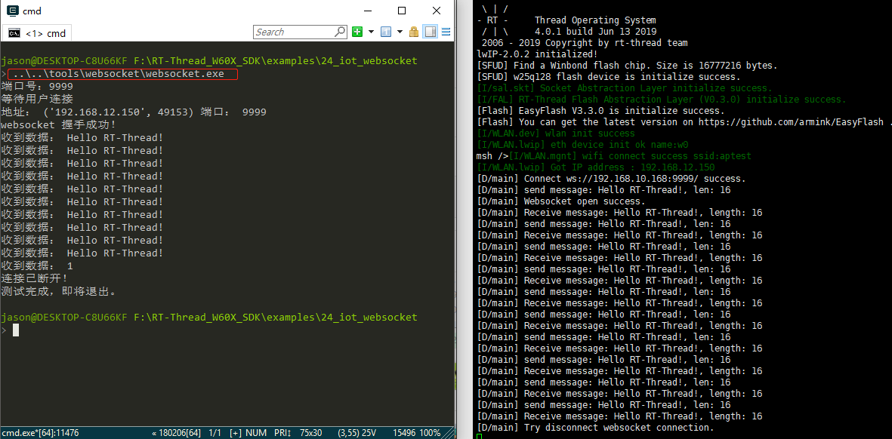

## 使用 websocket 软件包通信

本例程使用 `librws` 软件包与 PC 模拟的 websocket 服务器进行数据交互，展示 `websocket` 软件包通信过程。

## 简介

**WebSocket** 是一种在单个 TCP 连接上进行全双工通信的协议，于 2011 年被 IETF 定为标准RFC 6455，并由 RFC7936 补充规范。WebSocket 使得客户端和服务器之间的数据交换变得更加简单，允许服务端主动向客户端推送数据。

`librws ` 软件包是小型、跨平台 `websocket` 客户端 C 语言库，具有以下特点：

- 无其他额外的依赖
- 单一头文件接口，位于 `librws.h` 中
- 线程安全
- 线程后台处理发送/接收逻辑

## 硬件说明

本例程需要依赖 WiFi 功能完成网络通信，因此请确保硬件平台上的 WiFi 功能可以正常工作，并且能够连接网络。

## 软件说明

### 主函数代码说明

在主函数中进行了如下操作：

1. 配置 wlan 的自动连接功能并开启自动连接。
2. 使用 websocket 与 PC 模拟的 websocket 服务器进行连接、数据发送、接收等。

```c
int main(void)
{
    int i;
    static rws_socket socket;
    /* ！！！注意：要换成自己电脑的 IP 地址 */
    const char *host = "192.168.10.168";
    const char *send_text = "Hello RT-Thread!";

    /* 初始化分区表 */
    fal_init();
    /* 初始化 easyflash */
    easyflash_init();
    /* 配置 wifi 工作模式 */
    rt_wlan_set_mode(RT_WLAN_DEVICE_STA_NAME, RT_WLAN_STATION);
    /* 初始化自动连接配置 */
    wlan_autoconnect_init();
    /* 使能 wlan 自动连接 */
    rt_wlan_config_autoreconnect(RT_TRUE);

    /* 查询 wlan 是否处于连接状态 */
    while (rt_wlan_is_ready() != RT_TRUE)
    {
        rt_thread_delay(1000);
    }
    rt_sem_init(&rws_sem_rec, "rws_rec", 0, RT_IPC_FLAG_FIFO);
    /* 连接 echo.websocket.org */
    socket = rws_connect(host, 9999);
    if (RT_NULL == socket)
    {
        LOG_E("Can not connect %s",host);
        return 0;
    }

    for (i = 0; i < 10; i++)
    {
        /* 发送消息 */
        rws_send(socket, send_text);
        /* 等待接收完成 */
        rt_sem_take(&rws_sem_rec, RWS_RECEIVE_TIMEOUT);
        /* 比较发送消息与接收消息是否一致 */
        if (strcmp(text_rec, send_text) != 0)
        {
            LOG_E("Receive data: %s is different from send data: %s", text_rec, send_text);
        }
    }

    if (text_rec != RT_NULL)
    {
        rt_free(text_rec);
    }
    /* 断开连接 */
    rws_disconnect(socket);
}
```

### websocket 连接说明

websocket 连接函数，需要传入url 与端口号，本例程利用 `RT-Thread_W60X_SDK/tools/websocket` 的 websocket.exe 工具使电脑作为 websocket 服务端，默认端口号是 `9999`。该函数主要实现 socket 的创建与设置，以及连接、断开、接收数据等函数的实现，具体实现如下：

```c
static rws_socket rws_connect(const char *host, const int port)
{
    static rws_socket socket;

    /* 创建 socket */
    socket = rws_socket_create();
    if (socket == RT_NULL)
    {
        LOG_E("Librws socket create failed. ");
        return RT_NULL;
    }
    /* 设置 socket url */
    rws_socket_set_url(socket, "ws", host, port, "/");
    /* 设置 socket 连接回调函数 */
    rws_socket_set_on_connected(socket, &rws_open);
    /* 设置socket 断开连接回调函数 */
    rws_socket_set_on_disconnected(socket, &rws_close);
    /* 设置接收消息回调函数 */
    rws_socket_set_on_received_text(socket, &message_text_rec);
    /* 设置自定义模式 */
    rws_socket_set_custom_mode(socket);

    if (rws_socket_connect(socket) == RT_FALSE)
    {
        LOG_E("Connect ws://%s:%d/ failed. ", host, port);
        return RT_NULL;
    }
    LOG_D("Connect ws://%s:%d/ success.", host, port);

    return socket;
}
```

### websocket 断开连接说明

websocket 断开连接函数回收资源，断开 socket 连接，具体实现如下:

```c
static void rws_disconnect(rws_socket socket)
{
    rws_socket_disconnect_and_release(socket);
    LOG_D("Try disconnect websocket connection.");
}
```

### websocket 发送数据说明

websocket 发送数据函数主要是打印发送的数据、对数据进行发送，详细实现如下：

```c
static int rws_send(rws_socket socket, const char *text)
{
    LOG_D("send message: %s, len: %d", text, rt_strlen(text));
    rws_socket_send_text(socket, text);

    return RT_EOK;
}
```

## 运行

### 编译&下载

- **MDK**：双击 `project.uvprojx` 打开 MDK5 工程，执行编译。
- **IAR**：双击 `project.eww` 打开 IAR 工程，执行编译。

编译完成后，将开发板与 PC 机连接，然后将固件下载至开发板。

### 运行效果

在电路板上电前，双击打开 `RT-Thread_W60X_SDK/tools/websocket/websocket.exe`



开发板串口日志如下所示：

```c
 \ | /
- RT -     Thread Operating System
 / | \     4.0.1 build Jun 13 2019
 2006 - 2019 Copyright by rt-thread team
lwIP-2.0.2 initialized!
[SFUD] Find a Winbond flash chip. Size is 16777216 bytes.
[SFUD] w25q128 flash device is initialize success.
[I/sal.skt] Socket Abstraction Layer initialize success.
[I/FAL] RT-Thread Flash Abstraction Layer (V0.3.0) initialize success.
[Flash] EasyFlash V3.3.0 is initialize success.
[Flash] You can get the latest version on https://github.com/armink/EasyFlash .
[I/WLAN.dev] wlan init success
[I/WLAN.lwip] eth device init ok name:w0
msh />[I/WLAN.mgnt] wifi connect success ssid:aptest
[I/WLAN.lwip] Got IP address : 192.168.12.150
[D/main] Connect ws://192.168.10.168:9999/ success.
[D/main] send message: Hello RT-Thread!, len: 16
[D/main] Websocket open success.
[D/main] Receive message: Hello RT-Thread!, length: 16 
[D/main] send message: Hello RT-Thread!, len: 16
[D/main] Receive message: Hello RT-Thread!, length: 16 
[D/main] send message: Hello RT-Thread!, len: 16
[D/main] Receive message: Hello RT-Thread!, length: 16 
[D/main] send message: Hello RT-Thread!, len: 16
[D/main] Receive message: Hello RT-Thread!, length: 16 
[D/main] send message: Hello RT-Thread!, len: 16
[D/main] Receive message: Hello RT-Thread!, length: 16 
[D/main] send message: Hello RT-Thread!, len: 16
[D/main] Receive message: Hello RT-Thread!, length: 16 
[D/main] send message: Hello RT-Thread!, len: 16
[D/main] Receive message: Hello RT-Thread!, length: 16 
[D/main] send message: Hello RT-Thread!, len: 16
[D/main] Receive message: Hello RT-Thread!, length: 16 
[D/main] send message: Hello RT-Thread!, len: 16
[D/main] Receive message: Hello RT-Thread!, length: 16 
[D/main] send message: Hello RT-Thread!, len: 16
[D/main] Receive message: Hello RT-Thread!, length: 16 
[D/main] Try disconnect websocket connection.

```

### 连接无线网络

例程使能了 wlan 自动连接，之前有连接就会自动连接 wlan，运行效果日志之后，紧接着 wifi 连接成功日志，如下：

```	c
msh />[I/WLAN.mgnt] wifi connect success ssid:aptest
[I/WLAN.lwip] Got IP address : 192.168.12.26
```

如果没有连接或者网络相关信息被擦除，则需要在程序运行后会进入 MSH 命令行，等待用户配置设备接入网络。使用 MSH 命令 `wifi join <ssid> <password>` 配置网络（ssid 和 password 分别为设备连接的 WIFI 用户名和密码），如下所示：

```c
msh />wifi join ssid_test router_key_xxx
join ssid:ssid_test
[I/WLAN.mgnt] wifi connect success ssid:ssid_test
msh />[I/WLAN.lwip] Got IP address : 152.10.200.224
```

### websocket 

数据完成交互日志如下：

```c
[D/main] Connect ws://echo.websocket.org:80/ success.  # 成功连接服务器
[D/main] send message: Hello RT-Thread!, len: 16       # 发送数据
[D/main] Websocket open success.                       # 打开 websocket
[D/main] Receive message: Hello RT-Thread!, length: 16 # 接收数据
[D/main] send message: Hello RT-Thread!, len: 16    
[D/main] Receive message: Hello RT-Thread!, length: 16 
[D/main] send message: Hello RT-Thread!, len: 16
[D/main] Receive message: Hello RT-Thread!, length: 16 
[D/main] send message: Hello RT-Thread!, len: 16
[D/main] Receive message: Hello RT-Thread!, length: 16 
[D/main] send message: Hello RT-Thread!, len: 16
[D/main] Receive message: Hello RT-Thread!, length: 16 
[D/main] send message: Hello RT-Thread!, len: 16
[D/main] Receive message: Hello RT-Thread!, length: 16 
[D/main] send message: Hello RT-Thread!, len: 16
[D/main] Receive message: Hello RT-Thread!, length: 16 
[D/main] send message: Hello RT-Thread!, len: 16
[D/main] Receive message: Hello RT-Thread!, length: 16 
[D/main] send message: Hello RT-Thread!, len: 16
[D/main] Receive message: Hello RT-Thread!, length: 16 
[D/main] send message: Hello RT-Thread!, len: 16
[D/main] Receive message: Hello RT-Thread!, length: 16 
[D/main] Try disconnect websocket connection.          # 断开连接

```

## 注意事项

- `main` 函数中的 host 要换成自己电脑的 IP 地址，如果 websocket 代码没有运行，检查 wifi 是否连接。


## 引用参考

- 《RT-Thread 编程指南 》: docs/RT-Thread 编程指南.pdf
