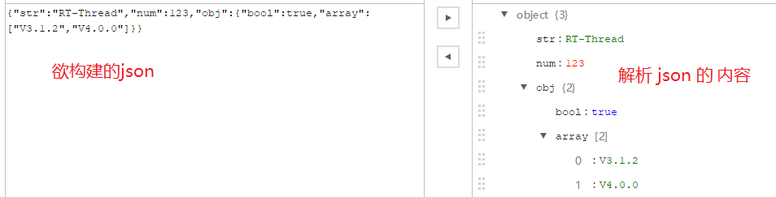

# JSON 数据构建与解析

本例程介绍如何使用 cJSON 软件包，详细介绍 JSON 数据的构建及针对所构建的 JSON 进行解析。

## 简介

json 是一种完全独立于编程语言的文本格式，用来存储和表示数据，具有以下特点：

- 简洁和层次结构清晰
- 易于人阅读和编写
- 易于机器解析和生成，并有效地提升网络传输效率

 RT-Thread [cJSON 软件包](https://github.com/RT-Thread-packages/cJSON)是一种超轻量级的 C 语言 JSON 解析库，具体 JSON 语法解析参考链接 <http://www.json.org/json-zh.html>，可以根据不同的语言习惯进行语言的选择。

## 硬件说明

json 数据构建与解析例程使用串口输出功能，无其他依赖。

## 软件说明

json 数据构建与解析位于 `/examples/25_iot_cjson/applications` 目录下，主要程序在 main 函数中，主要实现 json 的构建与解析，如下图所示

图中构建的 json 在构建函数中完成，解析的内容在解析函数中完成，具体如下。

**构建 json 函数**如下

```c
/* 构建 json */
static char *make_json()
{
    char *p;
    cJSON *json_root = cJSON_CreateObject(); /* 创建根索引 json 对象 */
    cJSON *json_sub = cJSON_CreateObject();  /* 创建子索引 json 对象 */
    cJSON *json_array = cJSON_CreateArray(); /* 创建数组 json 对象 */

    /* 判断创建 cjson 是否创建成功 */
    if (RT_NULL == json_root || RT_NULL == json_sub || RT_NULL == json_array)
    {
        LOG_E("Fail to creat cjson");
        rt_free(json_root);
        rt_free(json_sub);
        rt_free(json_array);
        return RT_NULL;
    }
    /* 添加键值对 */
    cJSON_AddStringToObject(json_root, "str", "RT-Thread"); /* 添加字符串型键值对 */
    cJSON_AddNumberToObject(json_root, "num", 123); /* 添加整型键值对 */

    /* 添加子 json 对象到子 json 对象中 */
    cJSON_AddItemToObject(json_root, "obj", json_sub);
    /* 添加 bool 类型给子 json 对象 */
    cJSON_AddTrueToObject(json_sub, "bool"); /* 添加 bool 型键值对 */

    /* 添加数组 json 对象到根 json 对象中 */
    cJSON_AddItemToObject(json_sub, "array", json_array);
    cJSON_AddStringToObject(json_array, 0, "V3.1.2"); /* 添加数组成员 */
    cJSON_AddStringToObject(json_array, 0, "V4.0.0");

    /* 生成无格式 json 字符串 */
    p = cJSON_PrintUnformatted(json_root);

    cJSON_Delete(json_root);
    return p;

}
```

**解析 json 函数**如下

```c
/* 解析构建的json */
static void parse_json(char *p)
{
    cJSON *root, *subordinate;
    RT_ASSERT(p);

    root = cJSON_Parse(p);
    if (RT_NULL == root)
    {
        LOG_E("Fail to parse root json");
        return;
    }

    /* 解析 json 中 CJSON_STR 键对应的字符串 */
    parse_string_kv(root, "str");
    /* 解析 json 中 "num" 键对应的数字 */
    parse_num_kv(root, "num");

    /* 解析子 json */
    subordinate = parse_key(root, "obj");
    /* 解析子 json 中 “bool” 键对应的 bool 值*/
    parse_bool_kv(subordinate, "bool");

    /* 解析 json 数组 */
    parse_array(subordinate, "array");

    cJSON_Delete(root);

}
```

```c
int main(void)
{
   /* 构建 json */
   char *p = make_json();

    if (RT_NULL == p)
    {
        LOG_E("Fail to make cjson");          
        return 0;
    }
    LOG_D("make json ->");
    LOG_D("%s", p);

    /* 解析组成的json */
    LOG_D("parse json ->");
    parse_json(p);

    rt_free(p);
    return 0;
}
```

## 运行

### 编译&下载

- **MDK**：双击 `project.uvprojx` 打开 MDK5 工程，执行编译。
- **IAR**：双击 `project.eww` 打开 IAR 工程，执行编译。

编译例程代码，然后将固件下载至开发板。

程序运行日志如下所示：

```shell
 \ | /
- RT -     Thread Operating System
 / | \     4.0.1 build May 14 2019
 2006 - 2019 Copyright by rt-thread team
[D/main] make json ->
[D/main] {"str":"RT-Thread","num":123,"obj":{"bool":true,"array":["V3.1.2","V4.0.0"]}}
[D/main] parse json ->
[D/main] str : RT-Thread
[D/main] num : 123
[D/main] obj :
[D/main]     bool : 1
[D/main]     array:
[D/main]            V3.1.2
[D/main]            V4.0.0
msh >
```

## 注意事项

- 构建 json 过长，可能导致使用该 json 生成的字符串无法完全输出


## 引用参考

- 《RT-Thread 编程指南 》: docs/RT-Thread 编程指南.pdf
