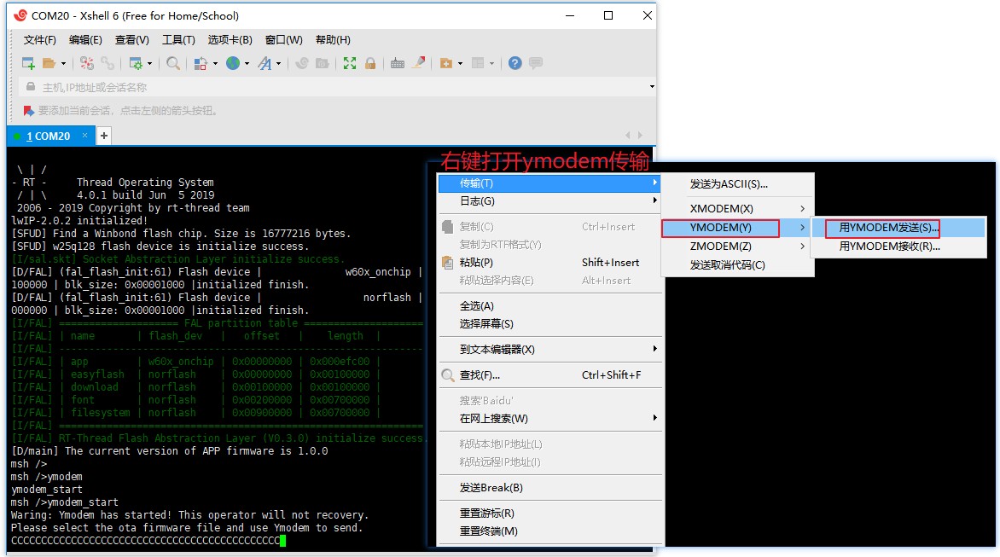
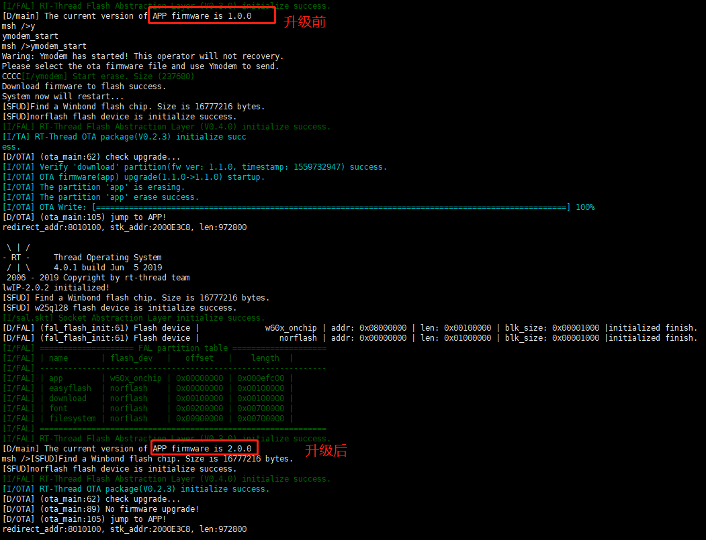

# Ymodem 协议固件升级例程

**Ymodem OTA 升级** 是 RT-Thread OTA 支持的固件下载器中的一种。在嵌入式设备中通常用于通过串口（UART）进行文件传输及 IAP 在线升级，是常用固件升级方式。

## 背景知识

### 固件升级简述

固件升级，通常称为 OTA（Over the Air） 升级或者 FOTA（Firmware Over-The-Air） 升级，即固件通过空中下载进行升级的技术。

### Ymodem 简述

Ymodem 是一种文本传输协议，在 OTA 应用中为空中下载技术提供文件传输的支持。基于 Ymodem 协议的固件升级即为 OTA 固件升级的一个具体应用实例。

### Flash 分区简述

通常嵌入式系统程序是没有文件系统的，而是将 Flash 分成不同的功能区块，从而形成不同的功能分区。

要具备 OTA 固件升级能力，通常需要至少有两个程序运行在设备上。其中负责固件校验升级的程序称之为 **bootloader**，另一个负责业务逻辑的程序称之为 **app**。它们负责不同的功能，存储在 Flash 的不同地址范围，从而形成了 `bootloader 分区`和 `app 分区`。

但多数情况下嵌入式系统程序是运行在 Flash 中的，下载升级固件的时候不会直接向 `app 分区`写入新的固件，而是先下载到另外的一个分区暂存，这个分区就是 `download 分区`，也有称之为 `app2 分区`，这取决于 bootloader 的升级模式。

bootloader 分区、app 分区、download 分区及其他分区一起构成了**分区表**。分区表标识了该分区的特有属性，通常包含分区名、分区大小、分区的起止地址等。

### bootloader 升级模式

bootloader 的升级模式常见有以下两种：

1. bootloader 分区 + app1 分区 + app2 分区模式

    该模式下，bootloader 启动后，检查 app1 和 app2 分区，哪个固件版本最新就运行哪个分区的固件。当有新版本的升级固件时，固件下载程序会将新的固件下载到另外的一个没有运行的 app 分区，下次启动的时候重新选择执行新版本的固件。

    优点：无需固件搬运，启动速度快。

    缺点：app1 分区和 app2 分区通常要大小相等，占用 Flash 资源；且 app1 和 app2 分区都只能存放 app 固件，不能存放其他固件（如 WiFi 固件）。

2. bootloader 分区 + app 分区 + download 分区模式

    该模式下，bootloader 启动后，检查 download 分区是否有新版本的固件，如果 download 分区内有新版本固件，则将新版本固件从 download 分区搬运到 app 分区，完成后执行 app 分区内的固件；如果download 分区内没有新版本的固件，则直接执行 app 分区内的固件。

    当有新版本的升级固件时，固件下载程序会将新的固件下载到 download 分区内，重启后进行升级。

    优点：download 分区可以比 app 分区小很多（使用压缩固件），节省 Flash 资源，节省下载流量；download 分区也可以下载其他固件，从而升级其他的固件，如 WiFi 固件、RomFs。
    
    缺点：需要搬运固件，首次升级启动速度略慢。

RT-Thread OTA 使用的是 bootloader 升级模式2，bootloader 分区 + app 分区 + download 分区的组合。

### RT-Thread OTA 介绍

**RT-Thread OTA** 是 RT-Thread 开发的跨 OS、跨芯片平台的固件升级技术，轻松实现对设备端固件的管理、升级与维护。

RT-Thread 提供的 OTA 固件升级技术具有以下优势：

- 固件防篡改 ： 自动检测固件签名，保证固件安全可靠
- 固件加密 ： 支持 AES-256 加密算法，提高固件下载、存储安全性
- 固件压缩 ： 高效压缩算法，降低固件大小，减少 Flash 空间占用，节省传输流量，降低下载时间
- 差分升级 ： 根据版本差异生成差分包，进一步节省 Flash 空间，节省传输流量，加快升级速度
- 断电保护 ： 断电后保护，重启后继续升级
- 智能还原 ： 固件损坏时，自动还原至出厂固件，提升可靠性
- 高度可移植 ： 可跨 OS、跨芯片平台、跨 Flash 型号使用
- 多可用的固件下载器：支持多种协议的 OTA 固件托管平台和物联网云平台

**RT-Thread OTA** 框架图如下所示：


从上面的 OTA 框架图可以发现，Ymodem 在 OTA 流程中充当的是 **OTA Downloader**（固件下载器）的角色，核心的 OTA 业务逻辑在 **RT OTA** 中，也就是封装到了 bootloader 固件里。 OTA 业务逻辑与应用程序解耦，极大简化了 OTA 功能增加的难度。

### OTA 升级流程

在嵌入式系统方案里，要完成一次 OTA 固件远端升级，通常需要以下阶段：

1. 准备升级固件（RT-Thread OTA 使用特定的 rbl 格式固件），并上传 OTA 固件到固件托管服务器
2. 设备端使用固件托管服务器对应的**固件下载器**下载 OTA 升级固件
3. 新版本固件下载完成后，在适当的时候重启进入 bootloader
4. bootloader 对 OTA 固件进行校验、解密和搬运（搬运到 app 分区）
5. 升级成功，执行新版本 app 固件

OTA 升级流程如下图所示：


## 硬件说明

本例程使用到的硬件资源如下所示：

- UART0(Tx: PA4; Rx: PA5)
- 片内 FLASH (1MBytes)
- 片外 Nor Flash (16MBytes)

## 分区表

| 分区名称   | 存储位置   | 起始地址   | 分区大小 | 结束地址   | 说明                  |
| ---------- | ---------- | ---------- | -------- | ---------- | --------------------- |
| app        | 片内 FLASH | 0x08010100 | 950K     | 0x080fd900 | app 应用程序存储区    |
| easyflash  | Nor FLASH  | 0x08000000 | 1M       | 0x08100000 | easyflash 存储区      |
| download   | Nor FLASH  | 0x08100000 | 1M       | 0x08200000 | download 下载存储区   |
| font       | Nor FLASH  | 0x08200000 | 7M       | 0x08900000 | font 字库分区         |
| filesystem | Nor FLASH  | 0x08900000 | 7M       | 0x09000000 | filesystem 文件系统区 |

分区表定义在 **`bootloader 程序`** 中，如果需要修改分区表，则需要修改 bootloader 程序。目前不支持用户自定义 bootloader，如果有商用需求，请联系 **RT-Thread** 获取支持。

## 软件说明

**Ymodem 例程**位于 `/examples/28_iot_ota_ymodem` 目录下，重要文件摘要说明如下所示：

| 文件                      | 说明   |
| :-----                    | :-----    |
| applications              | 应用 |
| applications/main.c  | app 入口 |
| applications/ymodem_update.c | ymodem 应用，实现了 OTA 固件下载业务 |
| ports/fal   | Flash 抽象层软件包（fal）的移植文件 |
| packages/fal              | fal 软件包 |

Ymodem 固件升级流程如下所示：

1. Ymodem 串口终端使用 ymodem 协议发送升级固件
2. APP 使用 Ymodem 协议下载固件到 download 分区
3. bootloader 对 OTA 升级固件进行校验、解密和搬运（搬运到 app 分区）
4. 程序从 bootloader 跳转到 app 分区执行新的固件

### Ymodem 代码说明

Ymodem 升级固件下载程序代码在 `/examples/28_iot_ota_ymodem/applications/ymodem_update.c` 文件中，仅有三个 API 接口，介绍如下：

**update 函数**

```c
void update(uint8_t argc, char **argv);
MSH_CMD_EXPORT_ALIAS(update, ymodem_start, Update user application firmware);
```

`update` 函数调用底层接口 `rym_recv_on_device` 启动 Ymodem 升级程序，并使用 RT-Thread `MSH_CMD_EXPORT_ALIAS` API 函数将其导出为 **`ymodem_start`** MSH 命令。

固件下载完成后，通过底层接口 `rym_recv_on_device` 获取下载状态，下载成功则重启系统，进行 OTA 升级。

**ymodem_on_begin 函数**

```c
static enum rym_code ymodem_on_begin(struct rym_ctx *ctx, rt_uint8_t *buf, rt_size_t len);
```

这是一个回调函数，通过底层接口 `rym_recv_on_device` 注册，在 Ymodem 程序启动后，获取到通过 Ymodem 协议发送给设备的文件后执行。主要是获取到文件大小信息，为文件存储做准备，完成相应的初始化工作（如 FAL download 分区擦除，为固件写入做准备）。

**ymodem_on_data 函数**

```c
static enum rym_code ymodem_on_data(struct rym_ctx *ctx, rt_uint8_t *buf, rt_size_t len);
```

这是一个数据处理回调函数，通过底层接口 `rym_recv_on_device` 注册，在接收到通过 Ymodem 协议发送给设备的数据后，执行该回调函数处理数据（这里将接收到的数据写入到 download 分区）。

## 运行

本例程演示使用 Ymodem OTA 功能烧录 v2.0.0 版本的 app 程序。

### 编译&下载

- **MDK**：双击 `project.uvprojx` 打开 MDK5 工程，执行编译。

编译完成后，将固件下载至开发板。

### 运行效果

按下复位按键重启开发板，正常运行后，可以看到当前版本为 v1.0.0。

```shell
 \ | /
- RT -     Thread Operating System
 / | \     4.0.1 build Jun  5 2019
 2006 - 2019 Copyright by rt-thread team
lwIP-2.0.2 initialized!
[SFUD] Find a Winbond flash chip. Size is 16777216 bytes.
[SFUD] w25q128 flash device is initialize success.
[I/sal.skt] Socket Abstraction Layer initialize success.
[D/FAL] (fal_flash_init:61) Flash device |              w60x_onchip | addr: 0x08000000 | len: 0x00100000 | blk_size: 0x00001000 |initialized finish.
[D/FAL] (fal_flash_init:61) Flash device |                 norflash | addr: 0x00000000 | len: 0x01000000 | blk_size: 0x00001000 |initialized finish.
[I/FAL] ==================== FAL partition table ====================
[I/FAL] | name       | flash_dev   |   offset   |    length  |
[I/FAL] -------------------------------------------------------------
[I/FAL] | app        | w60x_onchip | 0x00000000 | 0x000efc00 |
[I/FAL] | easyflash  | norflash    | 0x00000000 | 0x00100000 |
[I/FAL] | download   | norflash    | 0x00100000 | 0x00100000 |
[I/FAL] | font       | norflash    | 0x00200000 | 0x00700000 |
[I/FAL] | filesystem | norflash    | 0x00900000 | 0x00700000 |
[I/FAL] =============================================================
[I/FAL] RT-Thread Flash Abstraction Layer (V0.3.0) initialize success.
[D/main] The current version of APP firmware is 1.0.0
```

### 固件升级

修改例程中的 `APP_VERSION` 为  `2.0.0`，双击 `project.uvprojx` 打开 MDK5 工程，执行编译。编译完成后会在本例程的目录下生成 `Bin` 文件夹，该文件夹中已经生成了所需的升级固件 `rtthread.rbl`。

使用命令 **`ymodem_start`** 启动 Ymodem 升级。

- 打开支持 **Ymodem 协议**的串口终端工具（推荐使用 **Xshell**）

- 连接开发板串口，复位开发板，进入 MSH 命令行

- 在设备的命令行里输入 **`ymodem_start`** 命令启动 Ymodem 升级

- 选择升级使用 **Ymodem 协议**发送升级固件（选择刚才编译后生成的 **rt-thread.rbl** 固件）

    

- 设备升级过程

    

设备升级完成后会自动运行新的固件，从上图中的日志上可以看到，app 固件已经从 **1.0.0 版本**升级到了 **2.0.0 版本**。

**2.0.0 版本**的固件同样是支持 Ymodem 固件下载功能的，因此可以一直使用 Ymodem 进行 OTA 升级。用户如何需要增加自己的业务代码，可以基于该例程进行修改。

## 注意事项

- 串口终端工具需要支持 Ymodem 协议，并使用确认使用 Ymodem 协议发送固件
- 串口波特率 115200，无奇偶校验，无流控

## 引用参考

- 《RT-Thread 编程指南 》: docs/RT-Thread 编程指南.pdf
- 《RT-Thread OTA 用户手册》: docs/UM1004-RT-Thread-OTA 用户手册.pdf
