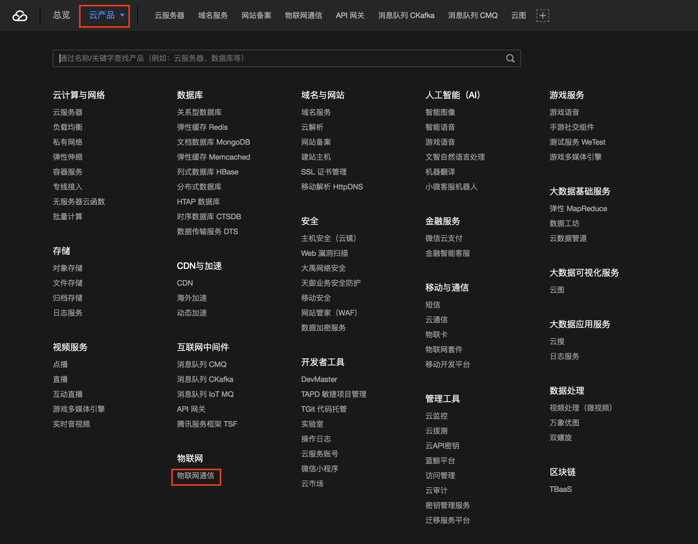
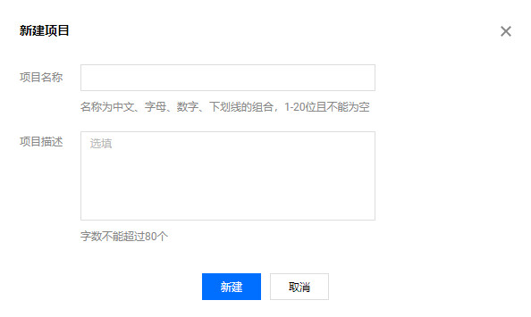
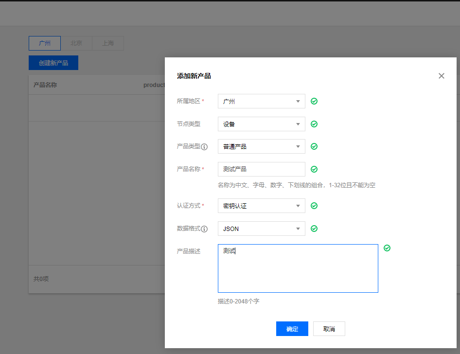
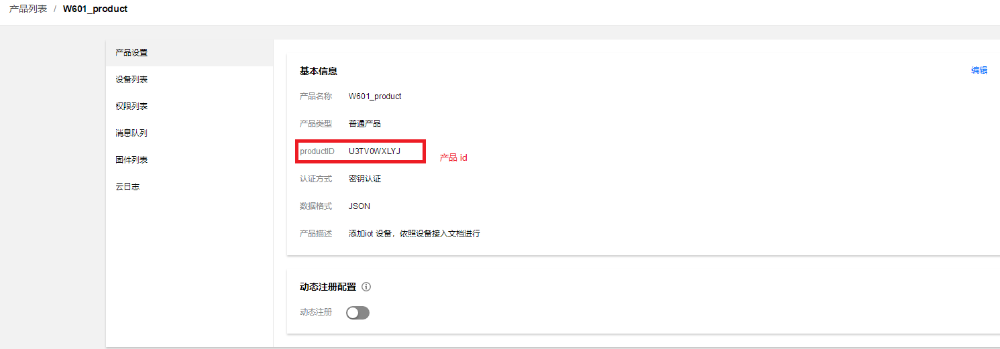
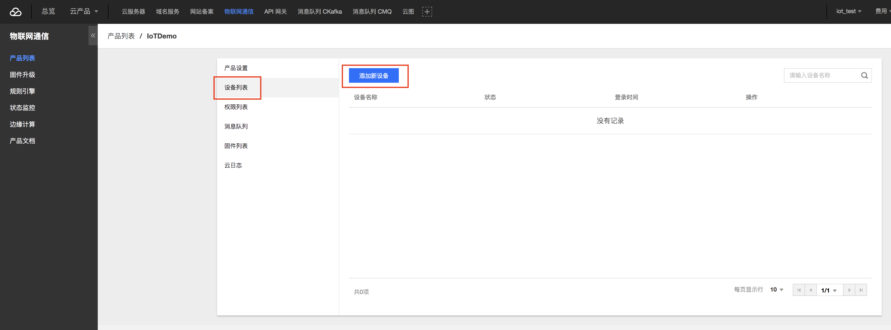
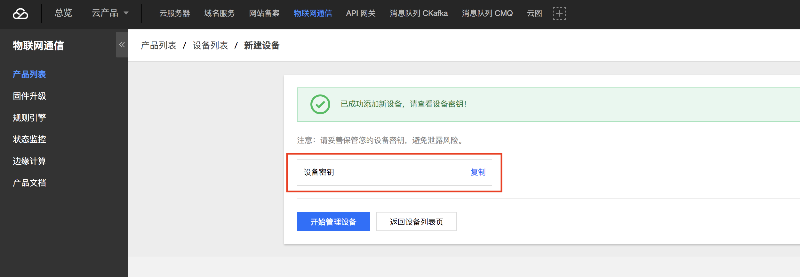
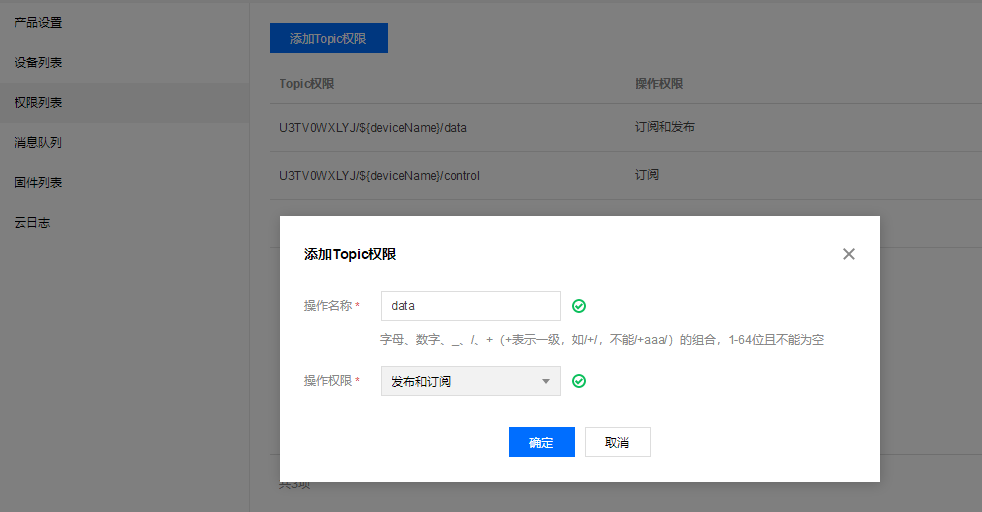
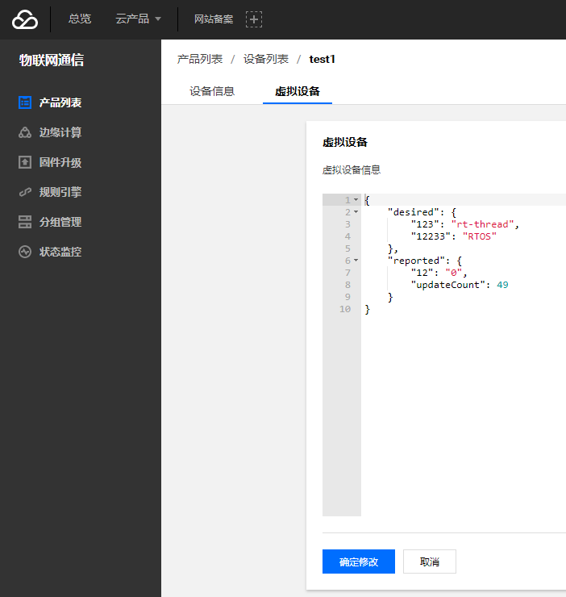

# 腾讯云物联网平台接入例程
本例程演示如何使用 Tencent IOT SDK for rt-thread Package 软件包接入腾讯云物联网平台。初次使用腾讯云物联网平台或者想了解更多使用例程，请阅读[《腾讯文档中心》](https://cloud.tencent.com/document/product)。


## 简介
**Tencent Iot-Kit for RTthread Package** 是基于[腾讯云 C-SDK ](https://github.com/tencentyun/tencent-cloud-iotsuite-embedded-c.git) 在 RT-Thread 环境开发的软件包，基于该软件包提供的能力，可以实现腾讯云 IOT 平台的连接及应用。

腾讯物联网设备端 C-SDK 依靠安全且性能强大的数据通道，为物联网领域开发人员提供终端和云端的双向通信能力。为了方便设备上云封装了丰富的连接协议，如 MQTT、CoAP、TLS，并且对硬件平台进行了抽象，使其不受具体的硬件平台限制而更加灵活。

本例程例程说明文档使用 MQTT + 无 TLS 示例，更多参考文档 [Tencent IOT SDK for rt-thread Package](packages/tencent-iot-sdk-v3.0.0/README.md)。

## 软件说明

tencent-cloud 例程位于 `/examples/35_iot-cloud_tencent` 目录下，重要文件摘要说明如下所示：

| 文件                                    | 说明                       |
| :-------------------------------------- | :------------------------- |
| applications/main.c                     | app 入口                   |
| ports                                   | 移植文件                   |
| packages/tencent-iot-sdk-v3.0.2         | 腾讯云物联网平台接入软件包 |
| packages/tencent-iot-sdk-v3.0.2/samples | 腾讯云物联网平台接入示例   |

## 例程使用说明

腾讯云物联网平台接入例程程序代码位于 `/examples/35_iot-cloud_tencent/packages/tencent-iot-sdk-v3.0.2/samples/iot_hub_platform/shadow_sample.c` 文件中，该示例展示了设备和[物联网通信平台](https://cloud.tencent.com/product/iothub)的基于[影子协议](https://cloud.tencent.com/document/product/634/11918)的 **MQTT 通信**示例，关于影子协议参见链接说明。

### 使用准备

如果需要更改使用自己的产品与设备，则需要获取产品 ID、设备名称、设备密钥。

**注册/登录腾讯云账号**
访问[腾讯云登录页面](https://cloud.tencent.com/login?s_url=https%3A%2F%2Fcloud.tencent.com%2F), 点击[立即注册](https://cloud.tencent.com/register?s_url=https%3A%2F%2Fcloud.tencent.com%2F), 免费获取腾讯云账号，若您已有账号，可直接登录。

**访问物联网通信控制台**
登录后点击右上角控制台，进入控制台后，鼠标悬停在云产品上，弹出层叠菜单，点击物联网通信。



或者直接访问[物联网通信控制台](https://console.qcloud.com/iotcloud)

**创建产品和设备**
点击页面**创建新产品**按钮, 创建一个产品，如下图所示



在弹出的产品窗口中，选择节点类型和产品类型，输入**产品名称**，认证方式选择密钥认证，数据格式选择 JSON，输入产品描述，然后点击确定创建，如下图所示：



创建成功后，自动进入下图界面



可以从图中获取**产品 ID**。点击**设备列表**页面添加新设备，如下所示



填写**设备名称**，其他默认，即可完成新建设备。同时，会在弹窗中显示新添加设备密钥，点击复制即可获取设备密钥，如下图所示



**创建可订阅可发布的 Topic**

按照**第三步**中进入产品设置页面的方法进入页面后, 点击权限列表，再点击**添加Topic权限**。在弹窗中输入 data, 并设置操作权限为**发布和订阅**，点击创建。



- 如果没有创建这个，回显信息会出现错误

**修改设备信息**

使用个人账户，在 `35_iot-cloud_tencent/rtconfig.h` 中修改对应的信息，修改位置如下所示
```c

#define PKG_USING_TENCENT_IOTHUB
#define PKG_USING_IOT_HUB_PLATFORM
#define PKG_USING_TENCENT_IOTHUB_PRODUCT_ID "U3TV0WXLYJ" # 产品id
#define PKG_USING_TENCENT_IOTHUB_DEVICE_NAME "test1"     # 设备名称
#define PKG_USING_TENCENT_IOTHUB_DEVICE_SECRET "1YvPX9KeqCArDPrUGkPaCA=="                               # 设备密钥
```

**下发状态**

修改如下状态，下发至设备：

- **reported**： 设备自身上报的状态，应用程序可以读取本文档部分，以获取设备的状态。

- **desired**： 设备预期的状态，设备 SDK 通过注册相关属性和回调，设备影子服务同步影子数据到设备。

修改位置如下图所示



### **发布 topic**

设备往腾讯云上发布消息，例程中发布的云平台设备名称为 `data`，代码实现如下

```c
static int _publish_msg(void *client)
{
    char topicName[128] = {0};
	sprintf(topicName,"%s/%s/%s", sg_devInfo.product_id, sg_devInfo.device_name, "data"); //发布消息的名称为 data
	

    PublishParams pub_params = DEFAULT_PUB_PARAMS;
    pub_params.qos = QOS1;

    char topic_content[MAX_SIZE_OF_TOPIC_CONTENT + 1] = {0};

	int size = HAL_Snprintf(topic_content, sizeof(topic_content), "{\"action\": \"publish_test\", \"count\": \"%d\"}", sg_count++);
	if (size < 0 || size > sizeof(topic_content) - 1)
	{
		Log_e("payload content length not enough! content size:%d  buf size:%d", size, (int)sizeof(topic_content));
		return -3;
	}

	pub_params.payload = topic_content;
	pub_params.payload_len = strlen(topic_content);

    return IOT_MQTT_Publish(client, topicName, &pub_params);
}
```

### 订阅 topic

设备接收腾讯云的消息，订阅消息与注册回调，例程中订阅的云平台设备名称为 `data`，代码实现如下

```c
static int _register_subscribe_topics(void *client)
{
    static char topic_name[128] = {0};    
    int size = HAL_Snprintf(topic_name, sizeof(topic_name), "%s/%s/%s", sg_devInfo.product_id, sg_devInfo.device_name, "data");  //订阅云平台的设备名称为 data
	
	if (size < 0 || size > sizeof(topic_name) - 1)
    {
        Log_e("topic content length not enough! content size:%d  buf size:%d", size, (int)sizeof(topic_name));
        return QCLOUD_ERR_FAILURE;
    }
    SubscribeParams sub_params = DEFAULT_SUB_PARAMS;
    sub_params.on_message_handler = on_message_callback; /* 注册订阅回调*/
    return IOT_MQTT_Subscribe(client, topic_name, &sub_params);
}
```

## 运行

### 编译&下载

- **MDK**：双击 `project.uvprojx` 打开 MDK5 工程，执行编译。
- **IAR**：双击 `project.eww` 打开 IAR 工程，执行编译。

编译完成后，将开发板的 ST-Link USB 口与 PC 机连接，然后将固件下载至开发板。

### 运行效果

程序运行日志如下所示：

```c
 \ | /
- RT -     Thread Operating System
 / | \     4.0.2 build Aug  8 2019
 2006 - 2019 Copyright by rt-thread team
lwIP-2.0.2 initialized!
[SFUD] Find a Winbond flash chip. Size is 16777216 bytes.
[SFUD] w25q128 flash device is initialize success.
[I/sal.skt] Socket Abstraction Layer initialize success.
[I/FAL] RT-Thread Flash Abstraction Layer (V0.3.0) initialize success.
[Flash] EasyFlash V3.3.0 is initialize success.
[Flash] You can get the latest version on https://github.com/armink/EasyFlash .
[I/WLAN.dev] wlan init success
[I/WLAN.lwip] eth device init ok name:w0
msh />[I/WLAN.mgnt] wifi connect success ssid:realthread
[I/WLAN.lwip] Got IP address : 192.168.12.156
```

- 注： 如果没有连接网络，使用 MSH 命令 `wifi join <ssid> <password>` 进行连接

### SHELL 命令

腾讯云物联网平台接入例程使用 MSH 命令演示与腾讯云物联网平台的数据交互，命令列表如下：

| 命令                    | 说明      |
| ----------------------- | --------- |
| tc_shadow_example start | 启动 MQTT |
| tc_shadow_example stop  | 停止 MQTT |

**启动 MQTT**

命令及日志如下

```c
msh />tc_shadow_example start                		 # 启动命令
msh />tc_shadow_example start
INF|39|packages\tencent-iot-sdk-v3.0.2\qcloud-iot-sdk-embedded-c\src\device\src\device_info.c|iot_device_info_set(65): SDK_Ver: 3.0.2, Product_ID: U3TV0WXLYJ, Device_Name: test1
DBG|39|packages\tencent-iot-sdk-v3.0.2\ports\rtthread\HAL_TCP_rtthread.c|HAL_TCP_Connect(68): establish tcp connection with server(host=u3tv0wxlyj.iotcloud.tencentdevices.com port=1883)
msh />DBG|40|packages\tencent-iot-sdk-v3.0.2\ports\rtthread\HAL_TCP_rtthread.c|HAL_TCP_Connect(101): success to establish tcp, fd=4
INF|40|packages\tencent-iot-sdk-v3.0.2\qcloud-iot-sdk-embedded-c\src\mqtt\src\mqtt_client.c|IOT_MQTT_Construct(115): mqtt connect with id: 835L6 success
DBG|40|packages\tencent-iot-sdk-v3.0.2\qcloud-iot-sdk-embedded-c\src\mqtt\src\mqtt_client_subscribe.c|qcloud_iot_mqtt_subscribe(139): topicName=$shadow/operation/result/U3TV0WXLYJ/test1|packet_id=8729
DBG|40|packages\tencent-iot-sdk-v3.0.2\qcloud-iot-sdk-embedded-c\src\shadow\src\shadow_client.c|_shadow_event_handler(63): shadow subscribe success, packet-id=8729
INF|40|packages\tencent-iot-sdk-v3.0.2\qcloud-iot-sdk-embedded-c\src\shadow\src\shadow_client.c|IOT_Shadow_Construct(172): Sync device data successfully
DBG|40|packages\tencent-iot-sdk-v3.0.2\qcloud-iot-sdk-embedded-c\src\shadow\src\shadow_client.c|IOT_Shadow_Get(383): GET Request Document: {"clientToken":"U3TV0WXLYJ-0"}
DBG|40|packages\tencent-iot-sdk-v3.0.2\qcloud-iot-sdk-embedded-c\src\mqtt\src\mqtt_client_publish.c|qcloud_iot_mqtt_publish(337): publish packetID=0|topicName=$shadow/operation/U3TV0WXLYJ/test1|payload={"type":"get", "clientToken":"U3TV0WXLYJ-0"}						      # 订阅成功
DBG|40|packages\tencent-iot-sdk-v3.0.2\qcloud-iot-sdk-embedded-c\src\shadow\src\shadow_client.c|_update_ack_cb(114): requestAck=0
DBG|40|packages\tencent-iot-sdk-v3.0.2\qcloud-iot-sdk-embedded-c\src\shadow\src\shadow_client.c|_update_ack_cb(117): Received Json Document={"clientToken":"U3TV0WXLYJ-0","payload":{"state":{"delta":{"12233":"rt-thread","123":"RTOS"},"desired":{"12233":"rt-thread","123":"RTOS"},"reported":{"12":"0","updateCount":728}},"timestamp":1565252748387,"version":741},"result":0,"timestamp":1565253811,"type":"get"}								# 接收成功

DBG|44|packages\tencent-iot-sdk-v3.0.2\qcloud-iot-sdk-embedded-c\src\shadow\src\shadow_client.c|IOT_Shadow_Update(317): UPDATE Request Document: {"state":{"reported":{"updateCount":0}}, "clientToken":"U3TV0WXLYJ-1"}
DBG|44|packages\tencent-iot-sdk-v3.0.2\qcloud-iot-sdk-embedded-c\src\mqtt\src\mqtt_client_publish.c|qcloud_iot_mqtt_publish(337): publish packetID=0|topicName=$shadow/operation/U3TV0WXLYJ/test1|payload={"type":"update", "state":{"reported":{"updateCount":0}}, "clientToken":"U3TV0WXLYJ-1"} 
```

**停止 MQTT**

命令及日志如下

```c
msh />tc_shadow_example stop                # 停止 MQTT
msh />DBG|366|packages\tencent-iot-sdk-v3.0.2\qcloud-iot-sdk-embedded-c\src\shadow\src\shadow_client.c|IOT_Shadow_Update(317): UPDATE Request Document: {"state":{"reported":{"updateCount":84}}, "clientToken":"U3TV0WXLYJ-5"}
DBG|366|packages\tencent-iot-sdk-v3.0.2\qcloud-iot-sdk-embedded-c\src\mqtt\src\mqtt_client_publish.c|qcloud_iot_mqtt_publish(337): publish packetID=0|topicName=$shadow/operation/U3TV0WXLYJ/test1|payload={"type":"update", "state":{"reported":{"updateCount":84}}, "clientToken":"U3TV0WXLYJ-5"}
INF|367|packages\tencent-iot-sdk-v3.0.2\qcloud-iot-sdk-embedded-c\src\mqtt\src\mqtt_client_connect.c|qcloud_iot_mqtt_disconnect(443): mqtt disconnect!
INF|367|packages\tencent-iot-sdk-v3.0.2\qcloud-iot-sdk-embedded-c\src\mqtt\src\mqtt_client.c|IOT_MQTT_Destroy(173): mqtt release!
ERR|367|packages\tencent-iot-sdk-v3.0.2\samples\iot_hub_platform\shadow_sample.c|mqtt_shadow_thread(173): Something goes wrong or stoped                  # 成功停止
```

## 注意事项

- 使用本例程前请先阅读[《腾讯文档中心》](https://cloud.tencent.com/document/product)
- 使用前请在 `menuconfig` 里配置自己的产品 ID、设备名称、设备密钥
- 注意腾讯云更新带来例程的变化

## 引用参考

- 《RT-Thread 编程指南 》: docs/RT-Thread 编程指南.pdf
- 《腾讯文档中心》：<https://cloud.tencent.com/document/product>

